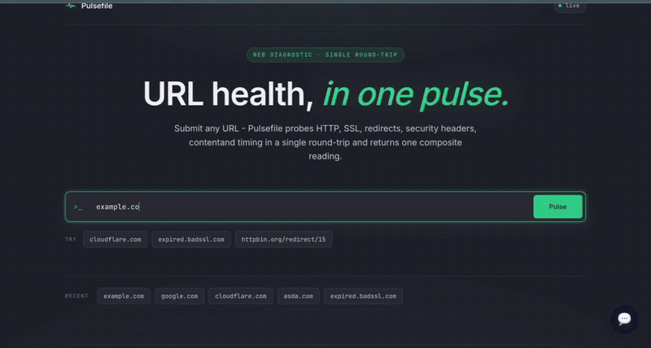
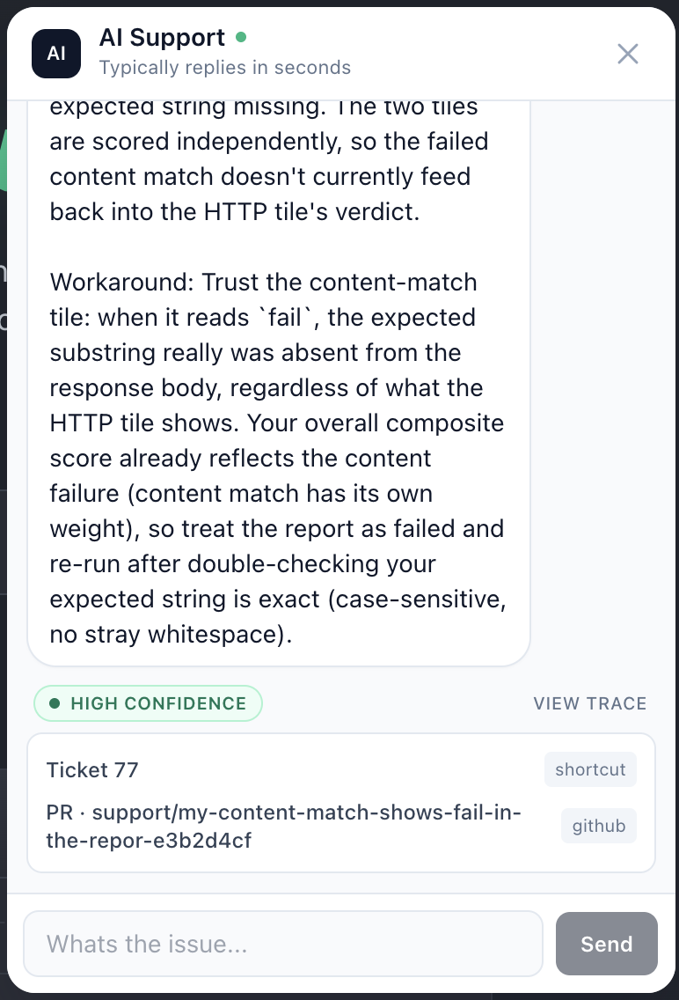
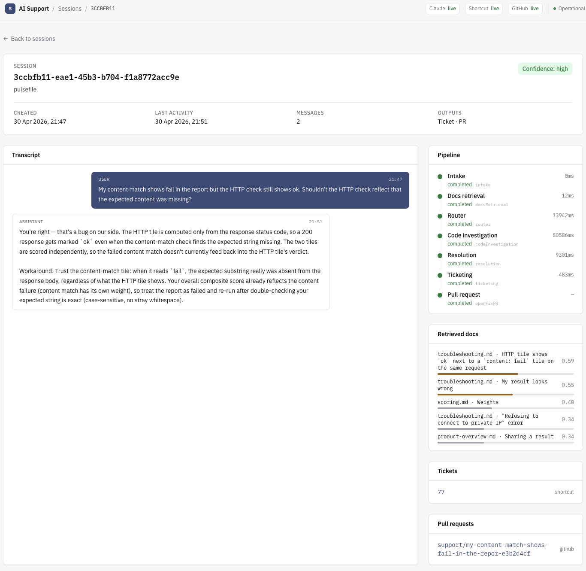
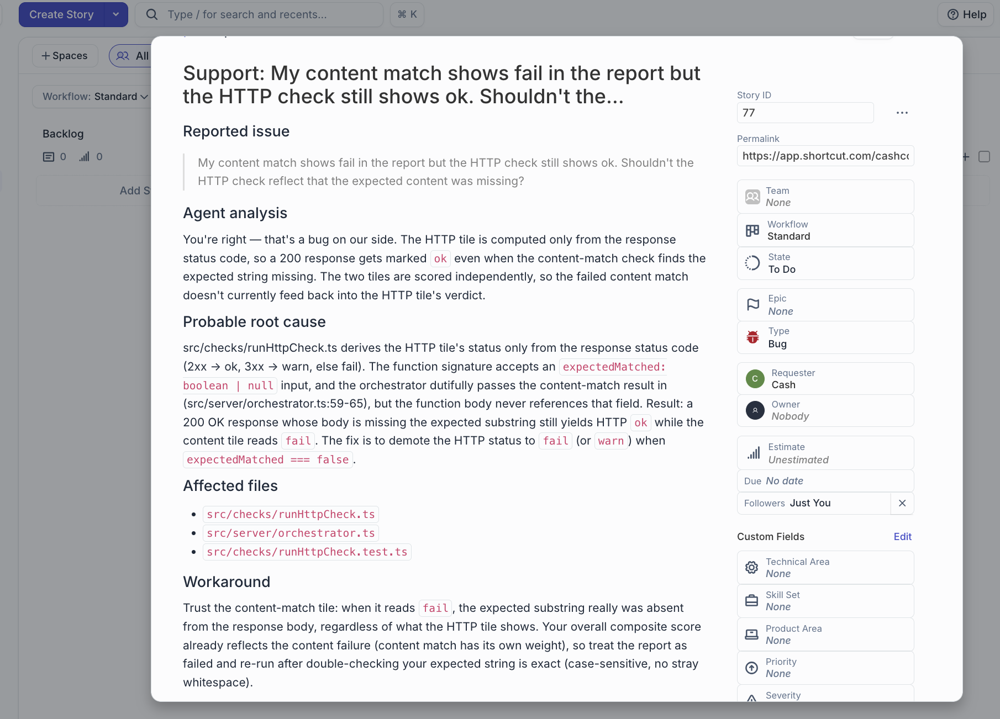
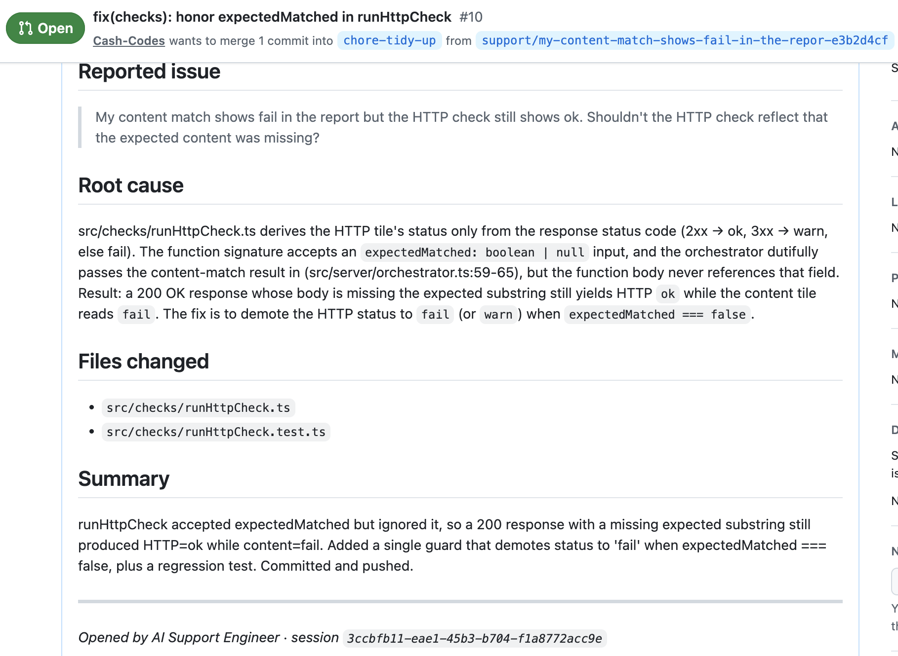

# AI Support Engineer

An embeddable AI support agent that reads your product docs, investigates your codebase when docs aren't enough, drafts a workaround for the user and - when the issue is a confirmed bug - opens a Shortcut ticket and a GitHub PR with the fix. Drop one `<script>` tag into any page and a chat widget appears. Visitors get a real answer, you get a real ticket and a real PR.

[](https://github.com/Cash-Codes/AI_support_engineer/actions/workflows/ci.yml)

[](#)


## 🌐 Live Demo

- 🔗 **Host product:** https://pulsefile-306383644133.us-central1.run.app - open the chat avatar in the bottom-right
- 🔗 **Replay dashboard:** https://agent-api-410174423188.us-central1.run.app/dashboard/ - every session that ran through the widget shows up here with full phase timing

Three suggestion chips are pre-wired into the demo:

| Chip | Pipeline outcome |
|---|---|
| `SSL says tls_unreachable` | docs-only - agent answers from `troubleshooting.md` |
| `Timing fields show 0` | docs-only - documented v1 limitation |
| `Content match fails but HTTP shows ok` | escalates to **code investigation** → ticket + PR |

## 🎥 Demo



## Live Flow

```
Host page (e.g. Pulsefile)
  → <script src=".../widget/loader.js" data-product data-suggestions>
    → loader injects floating chat avatar + iframe
      → iframe SPA opens session, streams chat over SSE
        → API orchestrates the pipeline:
            intake
              → docsRetrieval     (RAG over product docs)
                → router          (Claude - docs-only or escalate?)
                  → codeInvestigation  (Claude with Read/Grep/Glob in product repo)
                    → resolution  (Claude - synthesise answer + citations)
                      → ticketing (Shortcut story created)
                        → openFixPR (Claude in worktree → git push → gh pr create)
                          → response back to widget + replay in dashboard
```

## ✨ Features

- **One-tag embed.** A single `<script>` mounts the chat widget on any page. Iframe-isolated - never collides with host CSS or globals.
- **Local RAG.** Heading-chunked markdown, MiniLM embeddings via `@xenova/transformers`, cosine top-K. No external API key.
- **Router decides docs-only vs. code investigation.** Docs cover the symptom → answer and stop. Docs only describe the symptom → escalate.
- **Code investigation** spawns Claude Code with read-only Read / Grep / Glob, sandboxed to `PRODUCT_REPO_PATH`.
- **Auto-fix PRs.** A second Claude Code agent runs inside an isolated git worktree with Write / Edit / Bash(git *), applies the fix, commits, pushes, opens the PR via `gh pr create`. Your working tree is untouched.
- **Streamed phase events** (Server-Sent Events) - the widget renders progress in real time.
- **SQLite session persistence** (WAL) - every session replayable in the dashboard.
- **Mock mode** for the public demo. No Claude / Shortcut / GitHub credentials → fixture-keyword matcher answers, mock URLs returned, honest about being demo data.

## 🖼️ Screenshots


*The host product. Type a URL, get a Pulse Check report. Chat avatar in the bottom-right embeds the agent.*


*Every session that ran through the widget. Click a row to see the per-phase trace, citations and the ticket / PR URLs.*


*Auto-created Shortcut story. Title and body composed by the agent from the user's question + the resolution synthesis.*


*Auto-opened pull request. The fix-agent edited the source, ran tests, committed, pushed the branch and opened the PR with `gh pr create`.*

## 🧠 Tech Stack

**Backend (api)**

| Technology | Version | Role |
|---|---|---|
| Node.js | 22 | Runtime |
| TypeScript | 5 | Type safety |
| Express | 4 | HTTP server, SSE streaming, static file serving |
| better-sqlite3 | 11 | Synchronous SQLite, WAL mode, prepared statements |
| Pino | 9 | Structured JSON logging |
| Zod | 3 | Environment variable validation |
| @xenova/transformers | 2 | Local embeddings (all-MiniLM-L6-v2, 384-dim) |
| cors | 2 | Per-request same-origin + allow-list CORS |

**Frontend**

| Technology | Version | Role |
|---|---|---|
| React | 18 | UI framework (widget iframe + dashboard) |
| Vite | 5 | Build tool |
| Tailwind CSS | 3 | Utility-first styling |
| React Router | 6 | Dashboard routing (sub-path basename) |

**Agent**

| Technology | Role |
|---|---|
| Claude Code CLI | Spawned per pipeline phase (router, investigate, synthesize, fix-agent) |
| Read / Grep / Glob (read-only) | Used by the code-investigation phase |
| Read / Write / Edit / Bash(git *) | Used by the fix-agent phase, scoped to the worktree |
| `--permission-mode acceptEdits` | Enables autonomous commits in the worktree without interactive prompts |

**External APIs**

| Service | Purpose |
|---|---|
| Shortcut REST API | Ticket creation (`POST /api/v3/stories`) |
| GitHub via `gh` CLI | `gh pr create` for the fix branch |
| git worktrees | Isolated edit zones - your main checkout is never touched |

**Infrastructure**

| Technology | Role |
|---|---|
| pnpm workspaces | Monorepo: `apps/{api,dashboard,widget}` + `packages/shared` |
| Multi-stage Docker | Single container - api + bundled widget + bundled dashboard |
| Google Cloud Build | Remote linux/amd64 builds (no platform mismatch from Mac silicon) |
| Google Cloud Run | Production hosting, scale-to-zero, public unauthenticated |
| Biome | Lint + format |
| Husky | Pre-commit (biome) + pre-push (vitest) hooks |
| GitHub Actions | CI: lint / typecheck / test on every push |

## Architecture

```
AI_support_engineer/
├── apps/
│   ├── api/                          Express server, the orchestrator
│   │   ├── src/
│   │   │   ├── server.ts             Bootstrap: config + RAG + clients + listen
│   │   │   ├── app.ts                Express app factory + routers + CORS
│   │   │   ├── config.ts             Zod schema for all env vars
│   │   │   ├── logger.ts             Pino logger
│   │   │   ├── routes/
│   │   │   │   ├── chat.ts           POST /chat (SSE phase stream)
│   │   │   │   ├── session.ts        POST /session/init, GET /sessions[/:id]
│   │   │   │   ├── widget.ts         GET /widget/loader.js, /widget/* (iframe)
│   │   │   │   ├── dashboard.ts      GET /dashboard/* with SPA fallback
│   │   │   │   ├── health.ts         GET /health (modes + ragIndexed)
│   │   │   │   └── demo.ts           GET /demo/host.html (test page)
│   │   │   ├── orchestrator/
│   │   │   │   ├── index.ts          Pipeline runner with phase emit + override hooks
│   │   │   │   ├── intake.ts         Normalise user message
│   │   │   │   ├── docsRetrieval.ts  RAG search top-K
│   │   │   │   ├── router.ts         Claude - docs-only vs escalate
│   │   │   │   ├── codeInvestigation.ts  Claude - Read/Grep/Glob in product repo
│   │   │   │   ├── resolution.ts     Claude - synthesise final answer
│   │   │   │   ├── composeTicket.ts  Build TicketDraft from resolution + investigation
│   │   │   │   ├── ticketing.ts      Shortcut create-story
│   │   │   │   └── openFixPR/
│   │   │   │       ├── index.ts      Worktree → fix-agent → push → PR
│   │   │   │       ├── worktree.ts   git worktree add / remove
│   │   │   │       └── prompts.ts    Fix-agent prompt builder
│   │   │   ├── clients/
│   │   │   │   ├── claude.ts         Live: spawn `claude --print --max-turns N`
│   │   │   │   ├── claude.mock.ts    Fixture-keyword matcher
│   │   │   │   ├── claude/
│   │   │   │   │   ├── spawn.ts      Generic Claude CLI spawn helper
│   │   │   │   │   ├── parse.ts      Extract last ```json block from stdout
│   │   │   │   │   └── prompts.ts    Phase prompt builders
│   │   │   │   ├── shortcut.ts       Live: POST /stories with Shortcut-Token
│   │   │   │   ├── shortcut.mock.ts  Returns realistic mock URLs
│   │   │   │   ├── github.ts         Live: spawn `gh pr create`
│   │   │   │   └── github.mock.ts    Returns deterministic fake PR URL
│   │   │   ├── rag/
│   │   │   │   ├── embeddings.ts     @xenova/transformers wrapper
│   │   │   │   ├── chunker.ts        Heading-based markdown chunking
│   │   │   │   ├── indexer.ts        Build + cache index
│   │   │   │   └── search.ts         Cosine similarity top-K
│   │   │   ├── sessions/
│   │   │   │   ├── store.ts          SessionStore interface + InMemoryStore
│   │   │   │   └── sqliteStore.ts    SqliteSessionStore (WAL, prepared, FIFO eviction)
│   │   │   ├── fixtures/
│   │   │   │   └── index.ts          Load JSON fixtures, keyword match
│   │   │   └── productRepo/
│   │   │       └── bootstrap.ts      Resolve PRODUCT_REPO_PATH or clone PRODUCT_REPO_URL
│   │   └── demo-assets/              Vendored snapshot: docs/ + fixtures/ for Cloud Run
│   ├── widget/                       Embeddable chat
│   │   ├── loader/                   IIFE script that mounts button + iframe
│   │   └── app/                      React iframe SPA (the chat itself)
│   └── dashboard/                    React SPA (replay UI), bundled into api image
├── packages/
│   └── shared/                       Cross-app types: phases, RouterDecision, etc.
├── scripts/
│   ├── dev.sh                        Pre-flight + concurrently { api, dashboard }
│   ├── snapshot-demo-assets.sh       Vendor pulsefile docs + fixtures into the image
│   └── deploy-cloud-run.sh           gcloud builds submit + run deploy (idempotent)
├── Dockerfile                        Multi-stage: build all workspaces → slim runtime
├── .github/workflows/ci.yml          lint / typecheck / test
└── biome.json                        Lint + format config
```

**Why this layout?** Every directory has one job. `routes/` handles HTTP. `orchestrator/` holds the pipeline phases - each phase is one file with one async function. `clients/` wraps each external system (Claude, Shortcut, GitHub) and ships a `live` + `mock` implementation behind the same interface, so wiring is decided at boot from env. `rag/` is the embedding + retrieval stack, isolated from the rest. `sessions/` abstracts persistence so the in-memory store and SQLite store are interchangeable. `widget/` and `dashboard/` are independent React SPAs the api serves as static assets.

**Request pipeline (chat flow):**

```
Host page <script>
  → loader IIFE
    → injects floating button + sandboxed iframe
      → iframe loads /widget/?product=…&suggestions=…
        → POST /session/init                 sessionId returned
        → POST /chat                         (SSE; Content-Type: text/event-stream)
            → orchestrator.runPipeline()
                → emit('intake', 'started')
                → emit('docsRetrieval', 'started') → emit('completed')
                → emit('router', 'started') → claude.route() → emit('completed')
                → if escalate: emit('codeInvestigation', 'started')
                                → claude.investigate() → emit('completed')
                → emit('resolution', 'started') → claude.synthesize() → emit('completed')
                → emit('ticketing', 'started') → shortcut.createStory() → emit('completed')
                → if PR-worthy: emit('openFixPR', 'started')
                                 → worktree → claude fix-agent → push → gh pr create
                                 → emit('completed' | 'failed' | 'skipped')
                → emit('completed') with final ChatResponse
            → SSE stream closes
```

## Setup

### Prerequisites

- Node.js 22+
- pnpm (`corepack enable` will pick the version pinned in `package.json`)
- Git
- Claude Code CLI installed and authenticated (`npm install -g @anthropic-ai/claude-code` then `claude auth login`)
- A clone of a **product repo** the agent will read for code investigation (any git repo with `docs/*.md` works)
- For the live PR flow only: `gh` CLI authenticated, a Shortcut workspace + token, a GitHub repo to open PRs against

### 1. Clone and install

```bash
git clone https://github.com/Cash-Codes/AI_support_engineer.git
cd AI_support_engineer
pnpm install
```

### 2. Clone the product repo

The agent reads docs from `<PRODUCT_REPO_PATH>/docs/*.md` and (in code investigation) walks the source. The portfolio demo uses [pulsefile](https://github.com/Cash-Codes/Pulsefile):

```bash
git clone https://github.com/Cash-Codes/Pulsefile.git ~/projects/pulsefile
```

### 3. Configure environment

```bash
cp .env.example .env
```

Open `.env` and set at minimum:

```env
# The product repo the agent reads (docs + code investigation target)
PRODUCT_REPO_PATH=/Users/you/projects/pulsefile

# Origins allowed to embed the widget (CSV; the api auto-allows its own origin)
WIDGET_ALLOWED_ORIGINS=http://localhost:5175

# Base branch the openFixPR worktree forks from (defaults to "main")
PRODUCT_REPO_BASE_BRANCH=main
```

Without any other credentials configured, the api boots in **mock mode** - fixture-keyword matching for chat, deterministic mock URLs for tickets and PRs. Add the live integrations only when you want to exercise them.

See [Environment Variables](#environment-variables) for the full reference.

### 4. Authenticate Claude Code

The agent uses the locally-installed Claude Code CLI via OAuth - no API key required.

```bash
claude auth login
```

This opens a browser window. On modern macOS the credential lands in the Keychain (`security find-generic-password -s "Claude Code-credentials"`); on Linux it's `~/.claude/.credentials.json`. The api's auth detector handles both backends automatically.

### 5. Start the development server

```bash
./scripts/dev.sh
```

Pre-flight runs (`.env` present, `PRODUCT_REPO_PATH` exists, `gh` available), then `concurrently` runs:

- `api` on `http://localhost:8080`
- `dashboard` on `http://localhost:5174`

The boot log tells you which clients went live versus mock:

```
claude: live CLI client active   { auth: { kind: "cli", method: "claude.ai" } }
github: mock client active
shortcut: mock client active
api listening { port: 8080 }
```

### 6. Embed the widget in your host product

The agent serves a one-line loader at `/widget/loader.js`. Drop this anywhere in any HTML page (your product, a demo page, a test fixture):

```html
<script
  src="http://localhost:8080/widget/loader.js"
  data-api-base="http://localhost:8080"
  data-product="your-product-slug"
  data-suggestions='[
    {"label":"Common question A","query":"how do I do X?"},
    {"label":"Common question B","query":"why is Y not working?"}
  ]'
></script>
```

The loader injects a floating chat avatar + sandboxed iframe. The iframe is served from the api's origin (so its fetches to `/session/init`, `/chat`, etc. are same-origin and need no extra CORS). The host page's CORS is governed by `WIDGET_ALLOWED_ORIGINS` - make sure your host's origin is in the CSV.

`data-suggestions` is optional. When present, the empty-state shows clickable chips that pre-fill the message. When absent, the empty-state shows just the welcome text.

### 7. Trigger your first run

Visit `http://localhost:5175` (Pulsefile dev) or whichever host you embedded into. Click the chat avatar, click a chip - or type a question. Watch the api logs:

```
[20:42:42] phase completed                 { phase: "intake", durationMs: 0 }
[20:42:42] phase completed                 { phase: "docsRetrieval", durationMs: 12 }
[20:42:42] claude-cli: spawning            { tag: "router" }
[20:43:09] claude-cli: completed           { tag: "router", stdoutBytes: 1449 }
[20:43:09] claude-cli: spawning            { tag: "investigate" }
[20:43:44] claude-cli: completed           { tag: "investigate", stdoutBytes: 1585 }
[20:43:55] claude-cli: completed           { tag: "synthesize", stdoutBytes: 862 }
[20:43:56] shortcut: story created         { ticketId: 76, ticketUrl: "https://..." }
[20:43:56] worktree: created               { branch: "support/...", baseBranch: "main" }
[20:45:17] claude-cli: completed           { tag: "fix-agent", stdoutBytes: 853 }
[20:45:17] github: PR opened               { branch: "support/...", prUrl: "https://..." }
```

Replay the session at `http://localhost:5174/dashboard/`. Each phase is timed and traceable; ticket and PR URLs are linked.

### 8. Manual smoke test (no UI)

```bash
# 1. Create a session
SESSION=$(curl -s -X POST http://localhost:8080/session/init \
  -H "Content-Type: application/json" \
  -d '{"product":"pulsefile"}' | jq -r .sessionId)

# 2. Stream a question (SSE - Ctrl-C to stop)
curl -N -X POST http://localhost:8080/chat \
  -H "Content-Type: application/json" \
  -d "{\"sessionId\":\"${SESSION}\",\"message\":\"My HTTP check shows ok but content-match is failing - is that intended?\"}"

# 3. Read the persisted session
curl -s http://localhost:8080/sessions/${SESSION} | jq .
```

## Docker (local testing)

The same image is what deploys to Cloud Run.

### Build

```bash
docker build -t agent-api:local .
```

The Dockerfile is a multi-stage build on `node:22-slim`:

- **builder** - installs `python3 / make / g++` (for `better-sqlite3` + `onnxruntime` native bindings), runs `pnpm install --frozen-lockfile`, then builds shared → api → widget → dashboard in order.
- **runtime** - copies only `node_modules`, the built `dist/` of each workspace and the demo-assets snapshot. No build toolchain in the runtime image.

### Run

```bash
docker run --rm -p 8080:8080 \
  -e PRODUCT_REPO_PATH= \
  -e DEMO_MODE=true \
  -e DATABASE_PATH=:memory: \
  agent-api:local
```

Mock mode kicks in (no Claude credentials mounted, no Shortcut / GitHub tokens). Hit `http://localhost:8080/widget/`, `http://localhost:8080/dashboard/`, `http://localhost:8080/health`.

To exercise live Claude inside Docker, mount your credentials in:

```bash
# (macOS) Extract from Keychain to a flat file once
security find-generic-password -s "Claude Code-credentials" -w \
  > /tmp/claude-credentials-content
mkdir -p /tmp/claude-creds
echo '{"claudeAiOauth":'"$(cat /tmp/claude-credentials-content)"'}' \
  > /tmp/claude-creds/.credentials.json

docker run --rm -p 8080:8080 \
  -v /tmp/claude-creds/.credentials.json:/root/.claude/.credentials.json:ro \
  -v /Users/you/projects/pulsefile:/repos/pulsefile \
  -e PRODUCT_REPO_PATH=/repos/pulsefile \
  agent-api:local
```

## Cloud Run Deployment

Mock-mode deploy - bundles the demo-assets snapshot, runs without Claude / Shortcut / GitHub credentials. Public, scale-to-zero, ~£0/month at idle.

### One-shot

```bash
./scripts/deploy-cloud-run.sh
```

The script:

1. Re-snapshots `<PRODUCT_REPO_PATH>/docs` + `fixtures/mock-responses` into `apps/api/demo-assets/` so the image always matches the current product repo state.
2. Enables required APIs (`artifactregistry`, `cloudbuild`, `run`) idempotently.
3. Creates the Artifact Registry repo if missing.
4. `gcloud builds submit` - remote linux/amd64 build, ~3-5 min.
5. `gcloud run deploy` with the env vars below.

### Environment overrides

```bash
PROJECT_ID=ai-support-engineer \
REGION=us-central1 \
SERVICE_NAME=agent-api \
ALLOWED_ORIGINS="https://your-host.example.com,http://localhost:5175" \
./scripts/deploy-cloud-run.sh
```

`ALLOWED_ORIGINS` becomes `WIDGET_ALLOWED_ORIGINS` on the deployed service. The script uses `^@^` as the gcloud env-var delimiter so a CSV value like `https://a,http://b` survives parsing intact.

### Tightening CORS after the host product deploys

The agent allows any origin when `WIDGET_ALLOWED_ORIGINS` is empty (dev default). Once your host product has a public URL, restrict the allow-list:

```bash
ALLOWED_ORIGINS="https://your-host.example.com" \
SKIP_SNAPSHOT=1 \
./scripts/deploy-cloud-run.sh
```

The agent's own origin is **always** allowed automatically (the iframe at `/widget/` makes same-origin asset requests with `<script crossorigin>` / `<link crossorigin>`, which the CORS middleware permits via `req.headers.host`).

### Live mode in Cloud Run (advanced)

Mock mode is intentional for the public demo. To run a private live-mode deploy, mount Claude credentials via Secret Manager and set Shortcut / GitHub tokens:

```bash
gcloud secrets create claude-credentials --data-file=./claude-credentials.json
gcloud run services update agent-api \
  --region us-central1 \
  --set-secrets=/root/.claude/.credentials.json=claude-credentials:latest \
  --set-env-vars="^@^SHORTCUT_API_TOKEN=...@SHORTCUT_WORKSPACE_SLUG=...@GITHUB_TOKEN=...@GITHUB_REPO=...@ENABLE_PR_FLOW=true"
```

Live mode in Cloud Run also requires the product repo to be reachable inside the container (mount via Cloud Filestore NFS or bake into the image at build time).

## Testing

```bash
# Full suite (vitest)
pnpm test

# Watch mode in one workspace
pnpm --filter @ai-support/api test:watch

# Coverage
pnpm --filter @ai-support/api test -- --coverage

# Lint
pnpm lint

# Typecheck (across all workspaces)
pnpm typecheck
```

Tests:

- **Unit** - RAG chunker, RAG search, Claude output parser, fixture matcher, composeTicket.
- **Integration (HTTP + DB)** - supertest against a real Express app with an in-memory SQLite store; mocks for Claude / Shortcut / GitHub clients.
- **Worktree integration** - creates a real temp git repo, exercises `git worktree add` + remove, asserts the branch lifecycle.
- **Component tests** - jsdom + @testing-library/react for widget app + dashboard.

A Husky pre-commit hook runs Biome; pre-push runs `pnpm test`.

## Demo Mode

When `claude auth status` fails (no Claude installed / not logged in) **and** `PRODUCT_REPO_PATH` isn't a real path, the agent boots with all three integrations on mock:

- **claude:** mock client matches the user's normalised message against keyword arrays in fixture JSONs (`apps/api/demo-assets/fixtures/*.json` in the deployed image, or `<PRODUCT_REPO_PATH>/fixtures/mock-responses/*.json` locally).
- **shortcut:** returns `https://app.shortcut.com/<workspace-slug>/story/<random-id>` so screencasts look real.
- **github:** returns `https://example.test/pr/<branch>` (intentionally fake).

If the visitor's question doesn't match any fixture keywords, the agent returns the **fallback** fixture which is honest about being demo data:

> "This support agent is running in demo mode without a live LLM connected, so I can't fully investigate your question."

Re-snapshot the demo assets from your product repo:

```bash
./scripts/snapshot-demo-assets.sh
# or with a specific path:
./scripts/snapshot-demo-assets.sh /path/to/some-other-product
```

## Environment Variables

| Variable | Required | Default | Description |
|---|---|---|---|
| `PORT` | No | `8080` | Server listen port |
| `LOG_LEVEL` | No | `info` | Pino log level (`fatal\|error\|warn\|info\|debug\|trace`) |
| `DEMO_MODE` | No | `false` | Cosmetic flag - surfaced on `/health` and in widget headers |
| `ENABLE_PR_FLOW` | No | `false` | Master switch for the live `openFixPR` phase |
| `PRODUCT_REPO_PATH` | One of these | - | Absolute path to the product repo. Required for code investigation + auto-fix PRs |
| `PRODUCT_REPO_URL` | One of these | - | Git URL - clone into a writable dir at boot if `PRODUCT_REPO_PATH` is unset |
| `PRODUCT_REPO_BASE_BRANCH` | No | `main` | Base branch the `openFixPR` worktree forks from |
| `DOCS_DIR` | No | `<PRODUCT_REPO_PATH>/docs` | RAG corpus directory |
| `RAG_CACHE_PATH` | No | `data/rag-index.json` | Embedding cache (read on boot, written on first index build) |
| `DATABASE_PATH` | No | `data/sessions.db` | SQLite file. Use `:memory:` for ephemeral mode (Cloud Run default) |
| `FIXTURES_DIR` | No | (none) | Directory of fixture JSONs for the mock client |
| `WIDGET_ALLOWED_ORIGINS` | No | (allow any in dev) | CSV of origins permitted to embed the widget |
| `DASHBOARD_ORIGIN` | No | (allow any) | CORS origin for the dashboard's `/sessions` reads |
| `SHORTCUT_API_TOKEN` | Live shortcut | - | Token from `https://app.shortcut.com/settings/account/api-tokens` |
| `SHORTCUT_BASE_URL` | No | `https://api.app.shortcut.com/api/v3` | Override for tests / on-prem |
| `SHORTCUT_WORKSPACE_SLUG` | No | - | Used to build user-facing story URLs in mock + log lines |
| `SHORTCUT_WORKFLOW_STATE_ID` | No | (default) | Numeric workflow-state id - find via `GET /workflows` |
| `GITHUB_TOKEN` | Live PR | - | PAT or `gh auth token` output, repo scope |
| `GITHUB_REPO` | Live PR | - | `owner/repo` for `gh pr create` |

## Troubleshooting

**Boot log says `claude: mock client active { reason: "no-credentials" }` but I ran `claude auth login`**
The auth detector probes both `~/.claude/.credentials.json` (Linux / older mac CLI) and `claude auth status` (modern macOS, credentials in Keychain). If both fail, the api falls back to mock. Run `claude auth status` manually - if it doesn't print `loggedIn: true`, redo the login.

**Boot log says `mock client active { reason: "no-product-repo" }` even though `PRODUCT_REPO_PATH` is set**
The path doesn't exist or isn't a directory. The `productRepo/bootstrap.ts` resolver checks both. Confirm with `ls "$PRODUCT_REPO_PATH"`.

**Widget chips show but clicking does nothing / 404**
- Hard-reload - the loader's iframe URL probably came from a stale browser cache.
- Check the browser console for the iframe's `src` - if it contains `product=unknown` instead of your slug, the loader didn't read `data-product` (use `document.currentScript` synchronously, not in DOMContentLoaded).
- Verify CORS - open the iframe's URL directly. If it 404s, the api isn't running or `/widget/` isn't mounted.

**Widget loads but assets fail with `MIME type 'text/html'` - refused to apply CSS / JS**
Same-origin CORS rejection. The agent's own public URL (eg the Cloud Run hostname) wasn't in the allow-list. Fixed in app.ts by reading `req.headers.host` per-request - the iframe's own asset fetches always pass without listing the public hostname in env.

**Router decides `escalate=false` and skips code investigation when you wanted it**
Check the docs for the failing scenario. If `troubleshooting.md` / `known-issues.md` describe both the symptom and a usable workaround, the router correctly answers from docs alone. To force escalation, soften the docs (describe symptom only, no cause / no workaround) or sharpen the user's question to imply a code bug.

**`openFixPR: agent did not produce a usable fix { outcome: "no_changes" }`**
The fix-agent's worktree was forked from a branch that doesn't have the source files referenced in the investigation. Set `PRODUCT_REPO_BASE_BRANCH` to the branch where the code actually lives (commonly `main` after merging, but during early development your work might be on a feature branch).

**`openFixPR: error` with `"git commit was denied by the harness permission system"`**
The fix-agent CLI was spawned without `--permission-mode acceptEdits`. In `--print` mode, permission prompts auto-deny. The orchestrator passes `permissionMode: "acceptEdits"` to the fix-agent spawn; if you've forked the spawn helper, ensure that option is still wired through.

**`gcloud builds submit` fails with `the --mount option requires BuildKit`**
Cloud Build's default builder doesn't enable BuildKit. Drop `RUN --mount=type=cache,...` from your Dockerfile (it's just an optimisation), or submit with a custom `cloudbuild.yaml` that uses `docker buildx build`.

**`gcloud run deploy` fails with `Bad syntax for dict arg`**
A comma-containing env value (eg `WIDGET_ALLOWED_ORIGINS=https://a,http://b`) is being parsed by gcloud's default `,` delimiter. Use the `^@^` prefix: `--set-env-vars="^@^FOO=val1,val2@BAR=baz"`.

---

Good luck and feel free to reach out if you need any clarification or would like to contribute further. Always happy to help. Thanks!

---

**Document Version:** 1.0
**Last Updated:** May, 2026
**Maintainer:** Cashley <cashley.dps@gmail.com>
