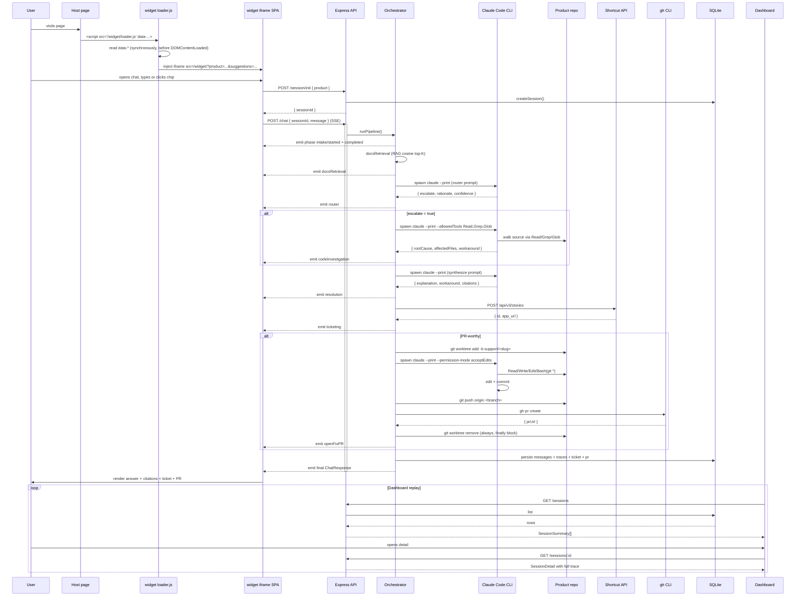

# AI Support Engineer - Technical Guide

---

## Table of Contents

1. [What the app does](#1-what-the-app-does)
2. [Project structure](#2-project-structure)
3. [Full request flow (diagram)](#3-full-request-flow-diagram)
4. [Backend walkthrough](#4-backend-walkthrough)
   - 4.1 [Entry point - `server.ts`](#41-entry-point--serverts)
   - 4.2 [Express app - `app.ts`](#42-express-app--appts)
   - 4.3 [Configuration - `config.ts`](#43-configuration--configts)
   - 4.4 [Logger - `logger.ts`](#44-logger--loggerts)
5. [Sessions layer](#5-sessions-layer)
   - 5.1 [Interface - `sessions/store.ts`](#51-interface--sessionsstorets)
   - 5.2 [SQLite store - `sessions/sqliteStore.ts`](#52-sqlite-store--sessionssqlitestorets)
6. [Routes and request handling](#6-routes-and-request-handling)
   - 6.1 [Session route - `routes/session.ts`](#61-session-route--routessessionts)
   - 6.2 [Chat route - `routes/chat.ts`](#62-chat-route--routeschatts)
   - 6.3 [Widget statics - `routes/widget.ts`](#63-widget-statics--routeswidgetts)
   - 6.4 [Dashboard statics - `routes/dashboard.ts`](#64-dashboard-statics--routesdashboardts)
   - 6.5 [Health - `routes/health.ts`](#65-health--routeshealthts)
7. [Orchestrator - the pipeline](#7-orchestrator--the-pipeline)
   - 7.1 [Pipeline runner - `orchestrator/index.ts`](#71-pipeline-runner--orchestratorindexts)
   - 7.2 [Phase 1: intake](#72-phase-1-intake)
   - 7.3 [Phase 2: docsRetrieval](#73-phase-2-docsretrieval)
   - 7.4 [Phase 3: router](#74-phase-3-router)
   - 7.5 [Phase 4: codeInvestigation](#75-phase-4-codeinvestigation)
   - 7.6 [Phase 5: resolution](#76-phase-5-resolution)
   - 7.7 [Phase 6: composeTicket + ticketing](#77-phase-6-composeticket--ticketing)
   - 7.8 [Phase 7: openFixPR](#78-phase-7-openfixpr)
8. [Claude client](#8-claude-client)
   - 8.1 [Live client - `clients/claude.ts`](#81-live-client--clientsclaudets)
   - 8.2 [Spawn helper - `clients/claude/spawn.ts`](#82-spawn-helper--clientsclaudespawnts)
   - 8.3 [Output parser - `clients/claude/parse.ts`](#83-output-parser--clientsclaudeparsets)
   - 8.4 [Mock client - `clients/claude.mock.ts`](#84-mock-client--clientsclaudemockts)
9. [Shortcut + GitHub clients](#9-shortcut--github-clients)
10. [RAG layer](#10-rag-layer)
    - 10.1 [Embeddings - `rag/embeddings.ts`](#101-embeddings--ragembeddingsts)
    - 10.2 [Chunker - `rag/chunker.ts`](#102-chunker--ragchunkerts)
    - 10.3 [Indexer - `rag/indexer.ts`](#103-indexer--ragindexerts)
    - 10.4 [Search - `rag/search.ts`](#104-search--ragsearchts)
11. [Fixtures - mock-mode matcher](#11-fixtures--mock-mode-matcher)
12. [Widget loader - `apps/widget/loader/src/loader.ts`](#12-widget-loader)
13. [Widget iframe app](#13-widget-iframe-app)
14. [Dashboard SPA](#14-dashboard-spa)
15. [Docker and deployment](#15-docker-and-deployment)
    - 15.1 [Dockerfile - multi-stage build](#151-dockerfile--multi-stage-build)
    - 15.2 [Snapshot script](#152-snapshot-script)
    - 15.3 [Deploy script](#153-deploy-script)
16. [Testing strategy](#16-testing-strategy)
17. [Security model](#17-security-model)
18. [Key design decisions and trade-offs](#18-key-design-decisions-and-trade-offs)

---

## 1. What the app does

A visitor on any page that has embedded the widget asks a support question. The agent:

1. Receives the question over a streaming HTTP connection (Server-Sent Events).
2. Searches the product's docs for the most relevant chunks (RAG).
3. Asks Claude to **route** - does the answer live in the docs, or do we need to look at code?
4. If routing says investigate, spawns a Claude Code CLI subprocess **with read-only file tools** inside the product repo. Claude uses Read / Grep / Glob to locate the root cause.
5. Asks Claude to **synthesise** the final answer - explanation, workaround, citations.
6. Composes a **Shortcut ticket** and creates it via the Shortcut REST API.
7. If the issue is a confirmed code bug, spawns a **second Claude Code CLI subprocess** in an isolated git worktree - this one has Write / Edit / Bash(git *) tools. It edits the source, runs tests, commits, pushes and opens a PR via `gh pr create`.
8. Streams every phase event back to the widget so the user sees real-time progress.
9. Persists the entire session - messages, traces, ticket, PR - into SQLite so the dashboard can replay it.

When external credentials aren't configured (Claude, Shortcut, GitHub), the agent runs in **mock mode**: a fixture-keyword matcher returns deterministic answers, ticket and PR URLs are fabricated. Honest about being demo data.

The widget is **embeddable** - drop one `<script>` tag into any page and a chat avatar + sandboxed iframe appears. The iframe runs on the agent's own origin so it doesn't pollute the host page's CSS or globals.

---

## 2. Project structure

```
AI_support_engineer/
├── apps/
│   ├── api/
│   │   ├── src/
│   │   │   ├── server.ts                Bootstrap: env, RAG, clients, listen
│   │   │   ├── app.ts                   Express app factory + middleware + routers
│   │   │   ├── config.ts                Zod schema for all env vars
│   │   │   ├── logger.ts                Pino logger
│   │   │   ├── routes/
│   │   │   │   ├── session.ts           POST /session/init, GET /sessions[/:id]
│   │   │   │   ├── chat.ts              POST /chat (SSE phase stream)
│   │   │   │   ├── widget.ts            /widget/loader.js + /widget/* iframe
│   │   │   │   ├── dashboard.ts         /dashboard/* SPA + fallback
│   │   │   │   ├── health.ts            GET /health
│   │   │   │   └── demo.ts              GET /demo/host.html (test page)
│   │   │   ├── orchestrator/
│   │   │   │   ├── index.ts             Pipeline runner with phase emit + override hooks
│   │   │   │   ├── intake.ts            Normalise user message
│   │   │   │   ├── docsRetrieval.ts     RAG search top-K
│   │   │   │   ├── router.ts            Stub (real impl injected via override)
│   │   │   │   ├── codeInvestigation.ts Stub (real impl injected via override)
│   │   │   │   ├── resolution.ts        Stub (real impl injected via override)
│   │   │   │   ├── composeTicket.ts     Build TicketDraft from resolution + investigation
│   │   │   │   ├── ticketing.ts         Stub (real impl wraps shortcut.createStory)
│   │   │   │   └── openFixPR/
│   │   │   │       ├── index.ts         Worktree → fix-agent → push → PR
│   │   │   │       ├── worktree.ts      git worktree add / remove
│   │   │   │       └── prompts.ts       Fix-agent prompt builder
│   │   │   ├── clients/
│   │   │   │   ├── claude.ts            Live: spawn `claude --print --max-turns N`
│   │   │   │   ├── claude.mock.ts       Fixture-keyword matcher
│   │   │   │   ├── claude/
│   │   │   │   │   ├── spawn.ts         Generic Claude CLI spawn helper
│   │   │   │   │   ├── parse.ts         Extract last ```json block from stdout
│   │   │   │   │   └── prompts.ts       Phase prompt builders
│   │   │   │   ├── shortcut.ts          Live: POST /stories with Shortcut-Token
│   │   │   │   ├── shortcut.mock.ts     Returns realistic mock URLs
│   │   │   │   ├── github.ts            Live: spawn `gh pr create`
│   │   │   │   └── github.mock.ts       Returns deterministic fake URL
│   │   │   ├── rag/
│   │   │   │   ├── embeddings.ts        @xenova/transformers wrapper
│   │   │   │   ├── chunker.ts           Heading-based markdown chunking
│   │   │   │   ├── indexer.ts           Build + cache index
│   │   │   │   └── search.ts            Cosine similarity top-K
│   │   │   ├── sessions/
│   │   │   │   ├── store.ts             Interface + InMemorySessionStore
│   │   │   │   └── sqliteStore.ts       SqliteSessionStore (WAL, prepared, FIFO)
│   │   │   ├── fixtures/
│   │   │   │   └── index.ts             Load JSON fixtures, keyword match
│   │   │   └── productRepo/
│   │   │       └── bootstrap.ts         Resolve PRODUCT_REPO_PATH or clone PRODUCT_REPO_URL
│   │   └── demo-assets/                 Vendored snapshot for Cloud Run image
│   ├── widget/
│   │   ├── loader/                      IIFE script that mounts button + iframe
│   │   └── app/                         React iframe SPA (the chat itself)
│   └── dashboard/                       React SPA (replay UI)
├── packages/
│   └── shared/                          Cross-app types (RouterDecision, PhaseEvent, ...)
├── scripts/
│   ├── dev.sh                           Pre-flight + concurrently { api, dashboard }
│   ├── snapshot-demo-assets.sh          Vendor pulsefile docs + fixtures into the image
│   └── deploy-cloud-run.sh              gcloud builds submit + run deploy (idempotent)
├── Dockerfile                           Multi-stage: build all → slim runtime
└── biome.json                           Linter + formatter config
```

**Why this layout?** Every directory has exactly one job. `routes/` is HTTP. `orchestrator/` is the pipeline - each phase is one file, one async function. `clients/` wraps each external system and ships a `live` + `mock` implementation behind the same interface so wiring happens at boot from env. `rag/` is the embedding stack, isolated. `sessions/` abstracts persistence so the in-memory and SQLite stores are interchangeable. `widget/` and `dashboard/` are independent React SPAs the api serves as static assets. A route never imports from a client; a client never imports from a route.

---

## 3. Full request flow (diagram)



---

## 4. Backend walkthrough

### 4.1 Entry point - `server.ts`

**File:** `apps/api/src/server.ts`

The bootstrap. Three phases: parse config, build dependencies, start listening.

```typescript
const config = parseConfig(process.env);
const logger = createLogger(config);

const productRepo = await resolveProductRepo({
  configPath: config.productRepo.path,
  configUrl: config.productRepo.url,
  logger,
});

let retriever: Retriever | undefined;
try {
  const embedder = await createEmbedder();
  retriever = await buildRetriever({ docsDir, cachePath, embedder, logger });
} catch (err) {
  logger.error({ err }, "rag: initialization failed - falling back to stub");
}

const claudeAuth = await detectClaudeAuth();
const claudeMode: "live" | "mock" =
  claudeAuth.kind !== "none" && productRepo.exists ? "live" : "mock";

let claude: ClaudeClient = claudeMode === "live"
  ? createLiveClaudeClient({ productRepoPath: productRepo.path!, logger })
  : createMockClaudeClient(fixtures);

const app = createApp({ config, logger, sessions, retriever, claude, /* ... */ });
app.listen(config.port);
```

The order matters:

1. **`parseConfig`** runs Zod against `process.env`. If a value is wrong (eg `LOG_LEVEL=nope`), the server refuses to start instead of crashing later with a confusing `undefined`.
2. **`resolveProductRepo`** picks the path that the rest of the app will treat as the product source of truth. If `PRODUCT_REPO_PATH` is set and exists, use it. If `PRODUCT_REPO_URL` is set, clone into a writable dir. Otherwise the live PR flow is unavailable.
3. **`buildRetriever`** loads or builds the RAG index. It's wrapped in try/catch - if the embedder fails (eg can't download MiniLM), the api still starts with retrieval disabled.
4. **`detectClaudeAuth`** probes both `~/.claude/.credentials.json` (file backend) and `claude auth status` (Keychain backend, modern macOS). Either signal is enough to wire the live client.
5. **`createApp`** is a pure function - given clients + sessions + retriever, it returns an Express app. This makes integration tests easy: pass in mocks, get a testable app.

#### Detecting Claude credentials

```typescript
const CLAUDE_CREDENTIALS_FILE_CANDIDATES = [
  "/root/.claude/.credentials.json",                       // Cloud Run / Docker mount
  path.join(os.homedir(), ".claude/.credentials.json"),    // Linux / older mac CLI
];

async function detectClaudeAuth(): Promise<ClaudeAuth> {
  for (const p of CLAUDE_CREDENTIALS_FILE_CANDIDATES) {
    try { await fs.access(p); return { kind: "file", path: p }; }
    catch { /* try next */ }
  }
  try {
    const { stdout } = await execFileAsync("claude", ["auth", "status"], { timeout: 5_000 });
    const parsed = JSON.parse(stdout);
    if (parsed.loggedIn) return { kind: "cli", method: parsed.authMethod };
  } catch { /* claude not installed or status failed */ }
  return { kind: "none" };
}
```

The portable check is `claude auth status --print` (returns JSON). Modern macOS stores credentials in the Keychain under `Claude Code-credentials` and there's no flat file at all - but `claude auth status` works against any backend the CLI knows about.

---

### 4.2 Express app - `app.ts`

**File:** `apps/api/src/app.ts`

Builds the Express app with two router groups - **widget-facing** (CORS-restricted) and **dashboard-facing** (separate CORS).

#### Widget CORS - same-origin auto-allow

The iframe is served from the api's own origin (eg `https://agent-api-XXX.run.app/widget/`). Its built `index.html` references assets with `<script type="module" crossorigin>` and `<link crossorigin>`. The `crossorigin` attribute makes the browser send an `Origin` header even for same-origin requests. If the agent's public hostname isn't in `WIDGET_ALLOWED_ORIGINS`, those asset fetches are rejected.

The fix is to derive same-origin from the request's `Host` and `X-Forwarded-Proto` headers per request:

```typescript
const widgetCors: express.RequestHandler = (req, res, next) => {
  const xfProto = req.headers["x-forwarded-proto"];
  const proto = (Array.isArray(xfProto) ? xfProto[0] : xfProto)
    ?.split(",")[0]?.trim() || (req.secure ? "https" : "http");
  const host = req.headers.host;
  const sameOrigin = host ? `${proto}://${host}` : null;

  cors({
    origin: (origin, cb) => {
      if (!origin) return cb(null, true);                      // no Origin header
      if (sameOrigin && origin === sameOrigin) return cb(null, true);
      if (config.cors.widgetOrigins.length === 0) return cb(null, true); // dev default
      if (config.cors.widgetOrigins.includes(origin)) return cb(null, true);
      cb(new Error(`origin ${origin} not allowed`));
    },
    credentials: false,
  })(req, res, next);
};
```

**Why per-request?** The cors lib's static config doesn't have access to the request. Wrapping in a custom middleware lets us read `req.headers.host` per call - so the agent works on `localhost:8080`, on `agent-api-410174423188.us-central1.run.app` and on a custom domain without baking any of those into env vars.

**Why trust `X-Forwarded-Proto`?** Cloud Run terminates TLS at the load balancer and forwards plain HTTP to the container; `req.protocol` would read "http" but the public origin is "https". Cloud Run guarantees this header is set; we read it directly rather than enabling Express's `trust proxy` flag.

#### Router wiring

```typescript
const widgetRouter = Router();
widgetRouter.use(widgetCors);
widgetRouter.use(buildSessionInitRouter(sessions));   // POST /session/init
widgetRouter.use(buildChatRouter(deps));              // POST /chat (SSE)
if (!skipWidgetStatic) {
  widgetRouter.use(buildWidgetRouter());              // /widget/loader.js + /widget/*
  widgetRouter.use(buildDemoRouter());                // /demo/host.html
}
app.use(widgetRouter);

const dashboardRouter = Router();
dashboardRouter.use(dashboardCors);
dashboardRouter.use(buildHealthRouter({ /* modes */ }));
dashboardRouter.use(buildSessionReadRouter(sessions));      // GET /sessions[/:id]
if (!skipWidgetStatic) {
  dashboardRouter.use(buildDashboardRouter());              // /dashboard/*
}
app.use(dashboardRouter);
```

The two router groups are kept separate so the widget's CORS rules don't leak to dashboard endpoints (which need different origins) and vice versa.

`skipWidgetStatic` exists for tests - supertest spins up the same `createApp()` factory but skips static-file mounting so the test process doesn't depend on the dist directories existing.

---

### 4.3 Configuration - `config.ts`

**File:** `apps/api/src/config.ts`

Every environment variable is a Zod field. Zod parses `process.env` at boot, validates types, applies defaults and throws a readable error if anything is wrong. Empty strings are normalised to `undefined` so `WIDGET_ALLOWED_ORIGINS=` and (unset) behave identically.

```typescript
const EnvSchema = z.object({
  PORT: z.string().optional().transform(v => v === undefined ? 8080 : Number(v))
    .refine(n => Number.isFinite(n) && n > 0 && n < 65536),
  LOG_LEVEL: z.enum(["fatal", "error", "warn", "info", "debug", "trace"]).default("info"),
  DEMO_MODE: z.enum(["true", "false"]).default("false").transform(v => v === "true"),
  ENABLE_PR_FLOW: z.enum(["true", "false"]).default("false").transform(v => v === "true"),
  PRODUCT_REPO_PATH: z.string().optional(),
  PRODUCT_REPO_BASE_BRANCH: z.string().default("main"),
  WIDGET_ALLOWED_ORIGINS: z.string().optional(),
  SHORTCUT_API_TOKEN: z.string().optional(),
  SHORTCUT_BASE_URL: z.string().url().default("https://api.app.shortcut.com/api/v3"),
  GITHUB_TOKEN: z.string().optional(),
  GITHUB_REPO: z.string().optional(),
  // ...
});
```

#### Shape of `AppConfig`

After parsing, the env is reshaped into a structured `AppConfig` with discriminated unions for each mock/live client:

```typescript
shortcut: {
  apiBase: string;
  workspaceSlug?: string;
} & (
  | { mode: "mock" }
  | { mode: "live"; token: string; workflowStateId?: number }
);
github: { mode: "mock" } | { mode: "live"; token: string; repo: string };
```

This makes the boot logic trivial - `if (config.github.mode === "live") { ... }` and TypeScript narrows `token` and `repo` to non-optional strings.

The github live mode requires **all three**: `ENABLE_PR_FLOW=true` AND `GITHUB_TOKEN` AND `GITHUB_REPO`. Setting just one or two falls back to mock - there's no half-live mode.

---

### 4.4 Logger - `logger.ts`

**File:** `apps/api/src/logger.ts`

A thin wrapper around Pino. In production it emits structured JSON one line per event (parseable by Cloud Run, GCP Logging, etc); in development it pretty-prints with colours via `pino-pretty`.

```typescript
export function createLogger(opts: { logLevel?: LogLevel } = {}): Logger {
  const level = opts.logLevel ?? "info";
  if (process.env.NODE_ENV === "production") {
    return pino({ level });
  }
  return pino({
    level,
    transport: { target: "pino-pretty", options: { colorize: true, translateTime: "HH:MM:ss" } },
  });
}
```

Every log call carries structured fields, never string interpolation:

```typescript
logger.info({ phase: "router", durationMs: 25833, outcome: "completed" }, "phase completed");
```

This means later you can grep / jq / GCP-query by field instead of by free text.

---

## 5. Sessions layer

A **session** is a chat conversation. It owns messages, traces, optional ticket, optional PR. Sessions persist across server restarts (SQLite default) and are evicted FIFO when the cap is reached (default 500).

### 5.1 Interface - `sessions/store.ts`

**File:** `apps/api/src/sessions/store.ts`

A small, deliberate interface. Two implementations: `InMemorySessionStore` for tests and `SqliteSessionStore` for everything else.

```typescript
export interface SessionStore {
  create(product: string): SessionSummary;
  has(sessionId: string): boolean;
  appendMessage(sessionId: string, message: ChatMessage): void;
  appendTrace(sessionId: string, trace: PipelineTrace): void;
  saveTicket(sessionId: string, ticket: TicketSummary): void;
  savePr(sessionId: string, pr: PRSummary): void;
  list(): SessionSummary[];
  getDetail(sessionId: string): SessionDetail | null;
}
```

`SessionSummary` is the dashboard-list view (id, product, lastActivityAt, has-ticket, has-pr). `SessionDetail` is the full record including every message and every phase trace.

The orchestrator never knows or cares which store is wired - the chat route calls `sessions.appendMessage(...)` and the right thing happens.

### 5.2 SQLite store - `sessions/sqliteStore.ts`

**File:** `apps/api/src/sessions/sqliteStore.ts`

Five tables - one per noun:

```sql
CREATE TABLE sessions (
  session_id        TEXT PRIMARY KEY,
  product           TEXT NOT NULL,
  created_at        TEXT NOT NULL,
  last_activity_at  TEXT NOT NULL
);
CREATE TABLE messages (
  session_id  TEXT NOT NULL REFERENCES sessions(session_id) ON DELETE CASCADE,
  idx         INTEGER NOT NULL,
  role        TEXT NOT NULL,
  content     TEXT NOT NULL,
  created_at  TEXT NOT NULL,
  PRIMARY KEY (session_id, idx)
);
CREATE TABLE traces (
  session_id  TEXT NOT NULL REFERENCES sessions(session_id) ON DELETE CASCADE,
  idx         INTEGER NOT NULL,
  phase       TEXT NOT NULL,
  status      TEXT NOT NULL,
  started_at  TEXT NOT NULL,
  duration_ms INTEGER,
  payload     TEXT,                 -- JSON blob
  PRIMARY KEY (session_id, idx)
);
CREATE TABLE tickets ( session_id TEXT PRIMARY KEY, ticket_id TEXT, ticket_url TEXT, provider TEXT );
CREATE TABLE prs     ( session_id TEXT PRIMARY KEY, pr_url TEXT, branch TEXT, provider TEXT );
```

#### WAL mode

```typescript
this.db = new Database(this.dbPath);
this.db.pragma("journal_mode = WAL");
this.db.pragma("foreign_keys = ON");
```

WAL (Write-Ahead Logging) lets readers and writers operate concurrently. The dashboard polls `GET /sessions` every few seconds while the orchestrator is writing trace rows; without WAL one would block the other.

#### Prepared statements

Every query is `db.prepare(...)` once at construction time, then `.run()` / `.get()` / `.all()` per call:

```typescript
this.insertSession = this.db.prepare(`
  INSERT INTO sessions (session_id, product, created_at, last_activity_at)
  VALUES (@sessionId, @product, @createdAt, @lastActivityAt)
`);
```

Prepared statements parse the SQL once (not per call), bind parameters safely (no SQL injection) and run faster.

#### FIFO eviction

```typescript
private evictOldest(): void {
  const count = this.countRow.get() as { count: number };
  if (count.count <= MAX_SESSIONS) return;
  const surplus = count.count - MAX_SESSIONS;
  this.evictStmt.run({ surplus });
}
```

The eviction statement orders by `(last_activity_at ASC, rowid ASC)` to break ties deterministically when many sessions land in the same millisecond (common in tests). `ON DELETE CASCADE` cleans up child rows.

#### `appendTrace` payload

```typescript
appendTrace(sessionId: string, trace: PipelineTrace): void {
  this.insertTrace.run({
    sessionId,
    idx: this.traceCount(sessionId),
    phase: trace.phase,
    status: trace.status,
    startedAt: trace.startedAt,
    durationMs: trace.durationMs ?? null,
    payload: trace.payload ? JSON.stringify(trace.payload) : null,
  });
  this.touchSessionStmt.run({ sessionId, ts: nowISO() });
}
```

Phase payloads (RouterDecision, CodeInvestigationResult, ResolutionResult, etc) are JSON-stringified into a single TEXT column rather than split into multiple typed columns - they're heterogeneous shapes and we always read them as a whole.

---

## 6. Routes and request handling

### 6.1 Session route - `routes/session.ts`

**File:** `apps/api/src/routes/session.ts`

Three endpoints. The init endpoint is widget-facing (CORS-restricted); the read endpoints are dashboard-facing.

```typescript
// POST /session/init - called by the widget
router.post("/session/init", (req, res) => {
  const parsed = InitBody.safeParse(req.body);   // { product: string }
  if (!parsed.success) return res.status(400).json({ error: "invalid body", ... });
  const summary = store.create(parsed.data.product);
  res.json({ sessionId: summary.sessionId });
});
```

```typescript
// GET /sessions - dashboard listing
router.get("/sessions", (_req, res) => res.json(store.list()));

// GET /sessions/:id - single session detail
router.get("/sessions/:id", (req, res) => {
  const detail = store.getDetail(req.params.id);
  if (!detail) return res.status(404).json({ error: "session not found" });
  res.json(detail);
});
```

The init endpoint creates the session before any message - the widget calls it on first mount. This makes the chat endpoint stateless (it just appends to an existing session) and lets the dashboard see "session created" entries even before the user sends anything.

### 6.2 Chat route - `routes/chat.ts`

**File:** `apps/api/src/routes/chat.ts`

The most complex route. It owns the SSE stream and wires all the orchestrator overrides.

```typescript
router.post("/chat", async (req, res) => {
  const { sessionId, message } = ChatBody.parse(req.body);
  if (!sessions.has(sessionId)) return res.status(404).json({ error: "session not found" });

  res.setHeader("Content-Type", "text/event-stream");
  res.setHeader("Cache-Control", "no-cache");
  res.setHeader("Connection", "keep-alive");
  res.flushHeaders();

  sessions.appendMessage(sessionId, { role: "user", content: message, createdAt: nowISO() });

  const overrides = buildPipelineOverrides({ retriever, claude, shortcut, github, /* ... */ });

  await runPipeline({
    intake: { originalMessage: message, normalized: message.toLowerCase().trim() },
    sessionId,
    overrides,
    flags: { prFlow: enablePrFlow },
    onPhase: (event: PhaseEvent) => {
      sessions.appendTrace(sessionId, /* ... */);
      res.write(`data: ${JSON.stringify(event)}\n\n`);
    },
  });

  res.end();
});
```

Three things to notice:

1. **Headers go before the first phase event.** `flushHeaders()` ensures the browser starts reading the SSE stream immediately; otherwise Node might buffer headers waiting for body data and the widget would hang for seconds before the first event.

2. **Each `onPhase` event is double-handed.** It's persisted to the session store *and* written to the wire. If the connection drops mid-pipeline, the trace is still complete in SQLite (the dashboard can replay it).

3. **Override wiring decides live vs mock.** The `buildPipelineOverrides` helper inspects each client's `mode` field and constructs the overrides accordingly:

```typescript
if (claude && claude.mode === "live") {
  overrides.router = (intake, retrieved) => claude.route(intake, retrieved);
  overrides.codeInvestigation = (intake, retrieved) => claude.investigate(intake, retrieved);
  overrides.resolution = (...) => claude.synthesize(...);
}
const liveFixPath = claude?.mode === "live" && github?.mode === "live" && productRepoPath;
if (liveFixPath) {
  overrides.openFixPR = async (resolution, investigation, intake) => {
    if (!investigation) return null;
    return runOpenFixPR({ intake, resolution, investigation }, {
      productRepoPath,
      baseBranch: productRepoBaseBranch,
      github,
      logger,
    });
  };
} else if (fixtures) {
  overrides.openFixPR = async (resolution) => buildMockPR(findFixtureByResolution(fixtures, resolution));
}
```

The orchestrator itself doesn't know `claude` exists. It calls `overrides.router(...)` and lets the wiring decide which implementation runs.

### 6.3 Widget statics - `routes/widget.ts`

**File:** `apps/api/src/routes/widget.ts`

Two static handlers. The order matters - the more specific path goes first.

```typescript
router.use("/widget/loader.js",
  express.static(path.join(widgetDistDir, "loader", "loader.js"), {
    maxAge: "5m",
    fallthrough: false,
  })
);

router.use("/widget",
  express.static(path.join(widgetDistDir, "app"), {
    fallthrough: false,
    index: "index.html",
  })
);
```

`fallthrough: false` means a missing file 404s instead of falling through to the next middleware. This is important - without it, a request for `/widget/missing.js` would slide past the static handler and hit some unrelated route.

### 6.4 Dashboard statics - `routes/dashboard.ts`

**File:** `apps/api/src/routes/dashboard.ts`

The dashboard is a Vite SPA built with `base: "/dashboard/"` so its built `index.html` references assets at `/dashboard/assets/...`. React Router's `BrowserRouter basename="/dashboard"` means client-side URLs are eg `/dashboard/sessions/abc`. Server-side, those paths don't exist - the static handler 404s, so we add an SPA fallback.

```typescript
router.use("/dashboard",
  express.static(dashboardDistDir, {
    maxAge: "1h",
    index: "index.html",
    fallthrough: true,    // missing files → next handler (the SPA fallback)
  })
);

router.get("/dashboard/*", (_req, res, next) => {
  const indexHtml = path.join(dashboardDistDir, "index.html");
  if (!fs.existsSync(indexHtml)) return next();
  res.sendFile(indexHtml);
});
```

Now `/dashboard/sessions/abc` → static handler doesn't find a file → falls through → catch-all sends `index.html` → React Router parses the path and renders the right route.

### 6.5 Health - `routes/health.ts`

**File:** `apps/api/src/routes/health.ts`

The dashboard reads `/health` on mount to populate the mode badges (Claude / Shortcut / GitHub: live or mock). The route deliberately reads modes from the **wired clients**, not from `config` - `config.claude.mode` is always `"mock"` (claude mode is decided at boot in `server.ts` based on auth detection, after the config is parsed):

```typescript
export function buildHealthRouter(deps: BuildHealthRouterDeps): RouterType {
  const { config, retriever, claudeMode, shortcutMode, githubMode } = deps;
  const router = Router();
  router.get("/health", (_req, res) => {
    res.json({
      ok: true,
      mode: claudeMode,       // "live" or "mock" - actual wired client
      shortcut: shortcutMode,
      github: githubMode,
      demoMode: config.demoMode,
      ragIndexed: retriever?.size() ?? 0,
    });
  });
  return router;
}
```

Wired in `app.ts`:

```typescript
buildHealthRouter({
  config, retriever,
  claudeMode: claude?.mode ?? config.claude.mode,
  shortcutMode: shortcut?.mode ?? config.shortcut.mode,
  githubMode: github?.mode ?? config.github.mode,
})
```

---

## 7. Orchestrator - the pipeline

The orchestrator is the heart of the app. It runs the seven-phase pipeline, emits a `PhaseEvent` per phase transition and supports per-phase overrides for tests + the live/mock swap.

### 7.1 Pipeline runner - `orchestrator/index.ts`

**File:** `apps/api/src/orchestrator/index.ts`

```typescript
export interface PipelineOverrides {
  docsRetrieval?: (i: IntakeResult) => Promise<DocsRetrievalResult>;
  router?: (i: IntakeResult, d: DocsRetrievalResult) => Promise<RouterDecision>;
  codeInvestigation?: (i: IntakeResult, d: DocsRetrievalResult) => Promise<CodeInvestigationResult>;
  resolution?: (i, d, c, r) => Promise<ResolutionResult>;
  ticketing?: (...) => Promise<TicketSummary | null>;
  openFixPR?: (resolution, investigation, intake) => Promise<PRSummary | null>;
}

export async function runPipeline(ctx: PipelineCtx): Promise<ChatResponse> {
  const { intake, overrides, onPhase, flags } = ctx;

  await timed("intake", async () => intake);     // pure pass-through, but emits the phase
  const docs = await timed("docsRetrieval", () => (overrides?.docsRetrieval ?? runDocsRetrieval)(intake));
  const decision = await timed("router", () => (overrides?.router ?? runRouter)(intake, docs));

  let investigation: CodeInvestigationResult | null = null;
  if (decision.escalate) {
    investigation = await timed("codeInvestigation", () =>
      (overrides?.codeInvestigation ?? runCodeInvestigation)(intake, docs));
  } else {
    onPhase({ phase: "codeInvestigation", status: "skipped" });
  }

  const resolution = await timed("resolution", () =>
    (overrides?.resolution ?? runResolution)(intake, docs, investigation, decision));

  const ticket = await timed("ticketing", () =>
    (overrides?.ticketing ?? runTicketing)(intake, resolution, investigation));

  let pr: PRSummary | null = null;
  if (flags.prFlow && investigation && overrides?.openFixPR) {
    pr = await timed("openFixPR", () => overrides.openFixPR!(resolution, investigation, intake));
  } else {
    onPhase({ phase: "openFixPR", status: "skipped" });
  }

  return { /* ChatResponse with resolution + ticket + pr + traces */ };
}

async function timed<T>(phase: PhaseName, fn: () => Promise<T>): Promise<T> {
  const startedAt = Date.now();
  onPhase({ phase, status: "started", startedAt: nowISO() });
  try {
    const result = await fn();
    onPhase({ phase, status: "completed", durationMs: Date.now() - startedAt, /* payload */ });
    return result;
  } catch (err) {
    onPhase({ phase, status: "failed", durationMs: Date.now() - startedAt, error: errMessage(err) });
    throw err;
  }
}
```

Three things this design buys:

1. **Test-friendly.** A test can call `runPipeline` with a fully-mocked `overrides` object and exercise only the orchestration logic, not real Claude.
2. **Live/mock swap is one place.** The chat route decides which overrides to inject based on client modes; the orchestrator never sees the difference.
3. **Phase events are uniform.** Every phase emits `started → completed | failed | skipped`. The widget just renders whatever it receives.

#### Skipped phases

When the router decides not to escalate, the orchestrator emits `codeInvestigation: skipped` rather than silently jumping to resolution. The widget shows a struck-out chip; the dashboard records it. This makes "the router decided not to investigate" visible to a reader of the trace.

### 7.2 Phase 1: intake

**File:** `apps/api/src/orchestrator/intake.ts`

The smallest phase. Normalises the raw user message:

```typescript
export function runIntake(message: string): IntakeResult {
  return {
    originalMessage: message.trim(),
    normalized: message.toLowerCase().trim(),
  };
}
```

`normalized` is what the fixture matcher uses for keyword search; `originalMessage` is what gets shown back to the user and passed to Claude prompts.

Intake is its own phase (rather than inlined) so future preprocessing (PII redaction, language detection, off-topic rejection) has a place to live.

### 7.3 Phase 2: docsRetrieval

**File:** `apps/api/src/orchestrator/docsRetrieval.ts`

Runs the RAG retriever against the user's message and returns the top-K matching doc chunks:

```typescript
export async function runDocsRetrieval(intake: IntakeResult): Promise<DocsRetrievalResult> {
  // Stub when no retriever - chat.ts injects the real one via override
  return { docs: [] };
}
```

The real implementation is injected via `overrides.docsRetrieval` in the chat route:

```typescript
overrides.docsRetrieval = async (intake) => ({
  docs: await retriever.search(intake.normalized, 5),
});
```

Top-K = 5 hits is enough for the router to make a decision and for the resolution phase to cite. More than 5 dilutes the prompt without adding signal.

### 7.4 Phase 3: router

**File:** `apps/api/src/orchestrator/router.ts` (stub) + `apps/api/src/clients/claude/prompts.ts` (real prompt)

The router is Claude with **no tools** - pure reasoning. It's given the user's message and the retrieved doc chunks and must return a JSON decision:

```typescript
{
  escalate: boolean,         // true → run code investigation; false → docs-only
  rationale: string,         // self-explanation
  confidence: "low" | "medium" | "high",
  draftAnswer?: string       // present when escalate=false
}
```

Decision rules in the prompt:

- **Escalate** when docs describe symptoms but not a fix, or when the issue looks like a code bug (silent data loss, unexpected state, wrong values).
- **Don't escalate** when docs clearly state cause + workaround.

The router runs with `--max-turns 4` and an empty `--allowedTools` list. It can't read code, it can't open the docs (only the retrieved chunks in its prompt). Cheap (~1500 stdout bytes), fast (~25 s).

### 7.5 Phase 4: codeInvestigation

**File:** `apps/api/src/orchestrator/codeInvestigation.ts` (stub) + Claude prompt with **read-only tools**

Only runs when the router escalates. Claude is spawned with:

```
--max-turns 30
--allowedTools "Read,Grep,Glob"
--cwd <PRODUCT_REPO_PATH>
```

The agent walks the source: greps for symptom-related strings, reads candidate files, follows imports. It returns:

```typescript
{
  rootCause: string,
  affectedFiles: string[],          // repo-relative paths
  workaround: string,
  confidence: "low" | "medium" | "high"
}
```

Read-only is the safety boundary. Even if the prompt is misleading, the agent can't write or run anything. The product repo is unmodified; only the agent's stdout carries information back.

Why **30** turns and not 10 or 60? Empirically Claude needs ~10–20 reads to locate a typical bug; 30 is a comfortable ceiling. Exceeding the turn limit returns whatever the agent has so far - usually still useful.

### 7.6 Phase 5: resolution

**File:** `apps/api/src/orchestrator/resolution.ts` (stub) + Claude prompt

Synthesises the final answer the user sees. Inputs: the raw question, the docs hits, the (optional) investigation result, the router decision. Output:

```typescript
{
  explanation: string,         // markdown, multi-paragraph
  workaround: string,          // markdown
  confidence: "low" | "medium" | "high",
  citations: string[]          // doc filenames referenced
}
```

The synthesizer is no-tools, like the router. Its job is purely composition - take the inputs and write the answer. ~7 s.

### 7.7 Phase 6: composeTicket + ticketing

**Files:** `apps/api/src/orchestrator/composeTicket.ts` + `apps/api/src/orchestrator/ticketing.ts`

`composeTicket` builds a `TicketDraft` from the resolution + investigation:

```typescript
{
  title: "Support: <truncated user message>",
  body: "## What the user reported\n...\n\n## Root cause\n<from investigation>\n\n## Workaround\n...\n\n## Affected files\n- path1\n- path2",
  storyType: "bug",                    // or "feature" depending on router signal
  labels: ["support-agent", "ai-triaged"],
}
```

Then `runTicketing` calls `shortcut.createStory(draft)`. In live mode this hits the real Shortcut API; in mock mode the mock client returns a fabricated `https://app.shortcut.com/<slug>/story/<id>` URL.

Ticketing is **always run** (not gated on escalation) - even docs-only resolutions get a ticket so support can see what users are asking, build trends and triage what should be auto-escalated next time.

### 7.8 Phase 7: openFixPR

**File:** `apps/api/src/orchestrator/openFixPR/index.ts`

The most complex phase. Only runs when:

- `ENABLE_PR_FLOW=true`
- Claude + GitHub clients are both live
- The investigation produced an `affectedFiles` list

Pipeline:

```typescript
export async function runOpenFixPR(input, opts): Promise<PRSummary | null> {
  const baseBranch = opts.baseBranch ?? "main";
  const branch = `support/${slugify(input.intake.originalMessage)}-${shortHash()}`;

  const worktree = await createWorktree({
    repoPath: opts.productRepoPath,
    baseBranch,
    branch,
  });

  try {
    const { outcome, summary } = await runFixAgent({
      input,
      worktree,
      timeoutMs: 5 * 60_000,
      logger: opts.logger,
    });

    if (outcome !== "applied") {
      logger.warn({ outcome, summary }, "openFixPR: agent did not produce a usable fix");
      return null;
    }

    await runGit(["push", "origin", branch], { cwd: worktree.path });

    const prSummary = await opts.github.createPullRequest(
      { branch, title: summary.title, body: summary.body, baseBranch },
      { cwd: worktree.path }
    );
    return prSummary;
  } finally {
    await removeWorktree({ repoPath: opts.productRepoPath, branch, worktreePath: worktree.path });
  }
}
```

Three properties to notice:

1. **The worktree is removed in `finally`.** Even if the fix-agent crashes, the worktree gets cleaned up. No leftover branches in the product repo's `.git/worktrees/`.
2. **The branch base is configurable.** `PRODUCT_REPO_BASE_BRANCH` env var → `opts.baseBranch` → `git worktree add -b <new> <path> <baseBranch>`. Defaults to `main` but is overridable for repos where development happens on a feature branch.
3. **Permission mode is `acceptEdits`.** The fix-agent runs `claude --print --permission-mode acceptEdits ...`. Without this, in `--print` mode the CLI auto-denies any tool use that requires interactive permission - including `git commit`. The agent would write the fix correctly but fail to commit it.

#### The fix-agent prompt

The prompt is in `openFixPR/prompts.ts`. It tells Claude:

- Branch: `<branch>`
- Investigation result (rootCause + affectedFiles + workaround)
- Resolution (the user-facing explanation)
- Constraints: minimal diff, run tests, conventional commit message, return JSON `{ outcome, summary }` at the end

The agent has Read / Write / Edit / Grep / Glob / Bash(git *). It's free to navigate the repo, edit files, run tests and commit - but only `git *` for bash, not arbitrary commands.

#### `createWorktree` / `removeWorktree`

**File:** `apps/api/src/orchestrator/openFixPR/worktree.ts`

`createWorktree` runs:

```bash
git worktree add -b <branch> <worktreePath> <baseBranch>
```

`worktreePath` is a temp dir under `os.tmpdir()` so the user's main checkout is untouched.

`removeWorktree` runs:

```bash
git worktree remove --force <worktreePath>
git branch -D <branch>          # if branch exists locally
```

Idempotent - if the worktree was already cleaned up by an earlier failure, the second call is a no-op.

---

## 8. Claude client

The Claude client wraps spawning the `claude` CLI as a subprocess. There are **two** implementations behind the same interface - `live` and `mock` - and four phase prompt builders (router, investigate, synthesize, fix-agent).

### 8.1 Live client - `clients/claude.ts`

**File:** `apps/api/src/clients/claude.ts`

```typescript
export interface ClaudeClient {
  route(intake, retrieved): Promise<RouterDecision>;
  investigate(intake, retrieved): Promise<CodeInvestigationResult>;
  synthesize(intake, retrieved, decision, investigation): Promise<ResolutionResult>;
  mode: "live" | "mock";
}

export function createLiveClaudeClient(opts: CreateLiveClaudeClientOptions): ClaudeClient {
  const { productRepoPath, logger } = opts;
  return {
    mode: "live",
    async route(intake, retrieved) {
      const { stdout } = await spawnClaude({
        prompt: buildRouterPrompt(intake, retrieved),
        cwd: productRepoPath,
        allowedTools: [],         // no tool use - pure reasoning
        maxTurns: 4,
        timeoutMs: 30_000,
        logger,
        tag: "router",
      });
      const parsed = extractLastJsonBlock<Partial<RouterDecision>>(stdout);
      if (!parsed.ok || !parsed.data) throw new Error(`claude router: ${parsed.reason}`);
      return normalizeRouter(parsed.data);
    },
    async investigate(intake, retrieved) { /* same shape, allowedTools = ["Read","Grep","Glob"], maxTurns: 30 */ },
    async synthesize(...) { /* same shape, no tools, maxTurns: 4 */ },
  };
}
```

#### Why subprocess and not the Anthropic API?

Two reasons:

1. **Authentication.** The CLI handles OAuth via `claude auth login`. No `ANTHROPIC_API_KEY` in env vars. Same auth mechanism the user already uses interactively.
2. **Tool use.** Claude Code CLI implements Read / Grep / Glob / Edit / Write / Bash with proper sandboxing, permission prompts and result formatting. Re-implementing those over the raw API would be hundreds of lines.

The cost is one subprocess per phase. ~25 s per call is acceptable; the alternative (re-implementing the agent loop ourselves) isn't worth the engineering time for a single-tenant agent.

#### Normalisation

```typescript
function normalizeRouter(raw: Partial<RouterDecision>): RouterDecision {
  return {
    escalate: typeof raw.escalate === "boolean" ? raw.escalate : true,
    rationale: typeof raw.rationale === "string" ? raw.rationale : "",
    confidence: ["low", "medium", "high"].includes(raw.confidence as string)
      ? (raw.confidence as Confidence) : "medium",
    draftAnswer: typeof raw.draftAnswer === "string" ? raw.draftAnswer : undefined,
  };
}
```

LLMs hallucinate. Sometimes Claude returns `confidence: "very high"` or `escalate: "yes"` (string) instead of `true` (boolean). The normaliser is a fail-safe: missing fields get sensible defaults; out-of-range values get clamped. Without this every output schema mismatch would crash the pipeline.

### 8.2 Spawn helper - `clients/claude/spawn.ts`

**File:** `apps/api/src/clients/claude/spawn.ts`

Generic subprocess runner used by every phase that calls Claude.

```typescript
export interface SpawnClaudeOptions {
  prompt: string;
  cwd: string;
  allowedTools: string[];
  maxTurns: number;
  timeoutMs: number;
  logger?: Logger;
  tag: string;
  permissionMode?: "acceptEdits" | "bypassPermissions" | "default" | "plan";
}

export async function spawnClaude(opts: SpawnClaudeOptions): Promise<SpawnClaudeResult> {
  const args = ["--print", "--max-turns", String(opts.maxTurns)];
  if (opts.allowedTools.length > 0) args.push("--allowedTools", opts.allowedTools.join(","));
  if (opts.permissionMode) args.push("--permission-mode", opts.permissionMode);

  return new Promise((resolve, reject) => {
    const child = spawn("claude", args, { cwd: opts.cwd, env: process.env });
    let settled = false;
    const stdoutChunks: string[] = [];
    const stderrChunks: string[] = [];

    const timer = setTimeout(() => {
      if (settled) return;
      settled = true;
      child.kill("SIGTERM");
      reject(new Error(`claude-cli timed out after ${opts.timeoutMs}ms`));
    }, opts.timeoutMs);

    child.stdout.on("data", c => stdoutChunks.push(c.toString()));
    child.stderr.on("data", c => stderrChunks.push(c.toString()));
    child.stdin.write(opts.prompt);
    child.stdin.end();

    child.on("close", code => {
      if (settled) return;
      settled = true;
      clearTimeout(timer);
      if (code !== 0) reject(new Error(`claude-cli exit ${code}: ${stderrChunks.join("").slice(0, 240)}`));
      else resolve({ stdout: stdoutChunks.join(""), stderr: stderrChunks.join("") });
    });
  });
}
```

Key details:

- **Prompt over stdin, not argv.** Long prompts (a few kilobytes) blow past argv length limits on some systems. Stdin is unbounded.
- **`SIGTERM` on timeout.** A wedged Claude (eg waiting for permission) doesn't respond to gentler signals; SIGTERM is the right blunt instrument.
- **`settled` guard.** Both timeout and `close` event can fire - without the flag, we'd resolve/reject twice. Promise safety.
- **Stderr is logged separately**, not raised as an error. Claude writes progress notes to stderr; only non-zero exit codes mean failure.

### 8.3 Output parser - `clients/claude/parse.ts`

**File:** `apps/api/src/clients/claude/parse.ts`

Extracts the **last** \`\`\`json block from the agent's stdout. Last because Claude often "thinks aloud" with intermediate JSON drafts before settling on the final answer.

```typescript
export function extractLastJsonBlock<T>(stdout: string): ParseResult<T> {
  const blocks = [...stdout.matchAll(/```json\s*\n([\s\S]*?)\n```/g)];
  if (blocks.length === 0) return { ok: false, reason: "no json block found" };
  const last = blocks[blocks.length - 1][1];
  try {
    return { ok: true, data: JSON.parse(last) as T };
  } catch (err) {
    return { ok: false, reason: `JSON parse failed: ${(err as Error).message}` };
  }
}
```

`ParseResult<T>` is a discriminated union - `{ ok: true, data }` or `{ ok: false, reason }`. Callers branch on `parsed.ok`; TypeScript narrows accordingly.

### 8.4 Mock client - `clients/claude.mock.ts`

**File:** `apps/api/src/clients/claude.mock.ts`

The mock client doesn't call Claude. It looks up the user's normalised message in a `FixtureLibrary` (loaded from `FIXTURES_DIR`) and returns the matching fixture's pre-recorded `router`, `codeInvestigation` and `resolution` objects.

```typescript
export function createMockClaudeClient(library: FixtureLibrary): ClaudeClient {
  return {
    mode: "mock",
    async route(intake) {
      const fixture = library.match(intake.normalized) ?? library.fallback();
      return fixture.router;
    },
    async investigate(intake) {
      const fixture = library.match(intake.normalized) ?? library.fallback();
      return fixture.codeInvestigation ?? STUB_INVESTIGATION;
    },
    async synthesize(intake) {
      const fixture = library.match(intake.normalized) ?? library.fallback();
      return fixture.resolution;
    },
  };
}
```

Same interface as the live client. The orchestrator never knows which one is wired.

---

## 9. Shortcut + GitHub clients

Same pattern as Claude - interface + live + mock.

**Shortcut live (`clients/shortcut.ts`):**

```typescript
const res = await fetch(`${apiBase}/stories`, {
  method: "POST",
  headers: { "Content-Type": "application/json", "Shortcut-Token": opts.apiToken },
  body: JSON.stringify({
    name: draft.title,
    description: draft.body,
    story_type: draft.storyType,
    labels: draft.labels.map(name => ({ name })),
    ...(opts.workflowStateId !== undefined ? { workflow_state_id: opts.workflowStateId } : {}),
  }),
  signal: AbortSignal.timeout(5_000),
});
```

5-second timeout - Shortcut is a third-party dependency; we don't want a slow API to block the chat for minutes.

**GitHub live (`clients/github.ts`):** spawns `gh pr create` rather than calling the GitHub REST API directly. The `gh` CLI handles auth via either `GH_TOKEN` env or a prior `gh auth login` and its output (the new PR URL on stdout) is trivial to parse.

```typescript
const args = ["pr", "create",
  "--title", draft.title, "--body", draft.body,
  "--head", draft.branch, "--base", draft.baseBranch];
const { stdout } = await runGh(args, { cwd, env, timeoutMs: 30_000 });
const url = stdout.trim().split("\n").pop() ?? "";
if (!/^https?:\/\//.test(url)) throw new Error(`gh pr create: unexpected output`);
return { prUrl: url, branch: draft.branch, provider: "github" };
```

**Mocks** for both return deterministic-ish URLs so screencasts look real:

- Shortcut mock: `https://app.shortcut.com/<workspaceSlug>/story/MOCK-XXXXXX` if a slug is configured, else `https://example.test/tickets/...`.
- GitHub mock: `https://example.test/pr/<branch>` (intentionally fake - never confused for a real PR).

---

## 10. RAG layer

Local embeddings, heading-based chunking, cached index, cosine top-K. No external API.

### 10.1 Embeddings - `rag/embeddings.ts`

**File:** `apps/api/src/rag/embeddings.ts`

Uses `@xenova/transformers` to run `sentence-transformers/all-MiniLM-L6-v2` locally - 384-dim sentence embeddings, ~22 MB model, runs on CPU in Node.

```typescript
import { pipeline } from "@xenova/transformers";

export async function createEmbedder(): Promise<Embedder> {
  const extractor = await pipeline("feature-extraction", "Xenova/all-MiniLM-L6-v2");
  return {
    async embed(text: string): Promise<number[]> {
      const output = await extractor(text, { pooling: "mean", normalize: true });
      return Array.from(output.data as Float32Array);
    },
    dim: 384,
  };
}
```

`pooling: "mean"` averages token vectors into a single sentence vector. `normalize: true` produces unit-length vectors so cosine similarity reduces to a dot product. Both are standard for retrieval.

The model downloads on first use (~22 MB into `~/.cache/huggingface/`) and is cached after that. In Cloud Run this means a small first-request latency penalty per cold start - acceptable for the demo, but a future optimisation is to bake the model into the image.

### 10.2 Chunker - `rag/chunker.ts`

**File:** `apps/api/src/rag/chunker.ts`

Markdown is chunked **by heading** rather than by fixed token count. Each H2 (or H3) section becomes one chunk, prefixed with the document title for context:

```typescript
export function chunkMarkdown(markdown: string, source: string): DocChunk[] {
  const lines = markdown.split("\n");
  const chunks: DocChunk[] = [];
  let currentTitle = source;
  let buffer: string[] = [];

  for (const line of lines) {
    const heading = line.match(/^(#{1,3})\s+(.+)$/);
    if (heading) {
      if (buffer.length) chunks.push({ source, title: currentTitle, body: buffer.join("\n").trim() });
      currentTitle = heading[2];
      buffer = [line];
    } else {
      buffer.push(line);
    }
  }
  if (buffer.length) chunks.push({ source, title: currentTitle, body: buffer.join("\n").trim() });
  return chunks.filter(c => c.body.length > 50);   // drop empty / trivial sections
}
```

**Why heading-based?** Documentation has natural structure. A user asking "Why does my SSL check fail?" should retrieve the "tls_unreachable" section as a unit, not a 500-token slice that happens to include parts of two sections. Heading chunks preserve semantic boundaries.

The 50-character threshold drops trivial sections (a heading with one short sentence) that would dilute the index.

### 10.3 Indexer - `rag/indexer.ts`

**File:** `apps/api/src/rag/indexer.ts`

Builds the index once at boot, caches it to disk:

```typescript
export async function buildRetriever(opts: BuildRetrieverOpts): Promise<Retriever> {
  const cached = await tryReadCache(opts.cachePath);
  if (cached && cached.dim === opts.embedder.dim && cached.docsHash === await hashDocsDir(opts.docsDir)) {
    opts.logger?.info({ count: cached.entries.length }, "rag: loaded index from cache");
    return makeRetriever(cached, opts);
  }

  opts.logger?.info("rag: rebuilding index");
  const docs = await readMarkdownFiles(opts.docsDir);
  const chunks = docs.flatMap(d => chunkMarkdown(d.body, d.source));
  const entries: IndexEntry[] = [];
  for (const c of chunks) {
    const vec = await opts.embedder.embed(`${c.title}\n${c.body}`);
    entries.push({ source: c.source, title: c.title, body: c.body, vec });
  }

  const index = { dim: opts.embedder.dim, docsHash: await hashDocsDir(opts.docsDir), entries };
  await fs.writeFile(opts.cachePath, JSON.stringify(index));
  opts.logger?.info({ count: entries.length, cachePath: opts.cachePath }, "rag: index built and cached");
  return makeRetriever(index, opts);
}
```

The cache is a single JSON file containing every chunk + its 384-dim vector. For 20 chunks (the deployed corpus) it's ~80 KB. The `docsHash` is a SHA-256 of all markdown content - when any doc changes, the hash differs and the index is rebuilt.

Cold rebuild for 20 chunks takes ~3–4 s (mostly model warmup); subsequent boots load from cache in ~10 ms.

### 10.4 Search - `rag/search.ts`

**File:** `apps/api/src/rag/search.ts`

Cosine similarity against the user's query embedding, sorted descending, top-K returned:

```typescript
export function search(index: IndexEntry[], queryVec: number[], k: number): RetrievedDoc[] {
  const scored = index.map(e => ({ entry: e, score: dot(e.vec, queryVec) }));
  scored.sort((a, b) => b.score - a.score);
  return scored.slice(0, k).map(s => ({
    source: s.entry.source,
    title: s.entry.title,
    body: s.entry.body,
    score: s.score,
  }));
}

function dot(a: number[], b: number[]): number {
  let sum = 0;
  for (let i = 0; i < a.length; i++) sum += a[i] * b[i];
  return sum;
}
```

Both vectors are unit-normalised so dot product = cosine. K = 5 by default.

For 20 entries this runs in <1 ms. At 10,000+ entries you'd want an approximate-nearest-neighbour index (HNSW, FAISS) but for support docs the brute-force loop is fine and deterministic.

---

## 11. Fixtures - mock-mode matcher

**File:** `apps/api/src/fixtures/index.ts`

Each fixture is a JSON file describing one canned answer:

```json
{
  "slug": "ssl-tls-unreachable",
  "keywords": ["tls_unreachable", "tls unreachable", "ssl says tls", ...],
  "router": { "escalate": false, "rationale": "...", "confidence": "high", "draftAnswer": "..." },
  "codeInvestigation": null,
  "resolution": { "explanation": "...", "workaround": "...", "confidence": "high", "citations": [...] },
  "ticket": { "title": "...", "body": "..." },
  "pr": { "branch": "...", "title": "...", "summary": "..." }
}
```

The library loads every JSON in `FIXTURES_DIR` and exposes a matcher:

```typescript
match(normalizedMessage: string): Fixture | undefined {
  for (const f of fixtures) {
    for (const k of f.keywords) {
      if (normalizedMessage.includes(k.toLowerCase())) return f;
    }
  }
  return undefined;
}
```

**Why substring keywords and not embeddings?** Keywords are deterministic and debuggable. Embeddings would feel more LLM-y but the demo's whole point is reproducibility - every keystroke a screencast viewer types should give the same answer.

When no fixture matches, the **fallback** fixture kicks in:

```typescript
const FALLBACK: Fixture = {
  slug: "no-match",
  keywords: [],
  router: { escalate: false, rationale: "No matching fixture and no live LLM is configured.", confidence: "low",
            draftAnswer: "This support agent is running in demo mode without a live LLM connected, so I can't fully investigate your question. ..." },
  resolution: { explanation: "Running in demo mode - no live LLM is connected, so this response is a generic placeholder. ...", ... },
};
```

The fallback is intentionally honest. Better to admit the demo's limits than to pretend the agent answered when it actually didn't.

---

## 12. Widget loader

**File:** `apps/widget/loader/src/loader.ts`

The IIFE that runs when the host page loads `<script src=".../widget/loader.js">`. Three responsibilities: read config from the script tag, inject DOM (button + iframe), wire open/close.

#### Reading config

```typescript
export function readConfigFromScript(script: HTMLScriptElement | null): LoaderConfig {
  const apiBase = script?.dataset.apiBase
    ?? new URL(".", script?.src ?? location.href).origin;
  const product = script?.dataset.product ?? "unknown";
  const suggestions = parseSuggestions(script?.dataset.suggestions);
  return { apiBase, product, suggestions };
}
```

Defaults are designed so the loader works even if you forget `data-api-base` - it derives from the script's own URL. `data-product` defaults to `"unknown"` so a misconfigured embed still loads (just with a useless product slug).

`parseSuggestions` JSON-parses `data-suggestions` and validates the shape - each element must be `{ label: string, query: string }` - with a try/catch fall-back to `undefined`. Malformed JSON doesn't break the widget; it just disables the suggestion chips.

#### `document.currentScript` timing

This is the loader's most subtle bug to write and most embarrassing one to ship:

```typescript
if (typeof document !== "undefined" && !("VITEST" in globalThis)) {
  // `document.currentScript` is only valid synchronously while the script is
  // executing. Inside a DOMContentLoaded callback it returns null.
  const script = document.currentScript as HTMLScriptElement | null;
  const run = () => mount(readConfigFromScript(script));
  if (document.readyState === "loading") {
    document.addEventListener("DOMContentLoaded", run);
  } else {
    run();
  }
}
```

`document.currentScript` is the WHATWG-spec property that points to the currently-executing `<script>` tag. It only works while the script is running synchronously - once you defer with `addEventListener("DOMContentLoaded", ...)`, the value is `null`.

The common pitfall is to call `readConfigFromScript(document.currentScript)` inside the deferred callback. That returns `apiBase = location.href.origin` (the host page's origin, not the api's) and `product = "unknown"`. The iframe then tries to load `/widget/?product=unknown` from the host's origin and 404s.

The fix is to capture `document.currentScript` at IIFE evaluation time, then close over it in the deferred callback. The script tag is captured exactly once, when the loader executes and the captured reference works regardless of when `mount()` actually runs.

#### Iframe injection

```typescript
const iframe = doc.createElement("iframe");
iframe.className = "ai-support-widget-frame";
iframe.title = "AI Support Chat";
const iframeUrl = new URL("/widget/", config.apiBase);
iframeUrl.searchParams.set("product", config.product);
if (config.suggestions?.length) {
  iframeUrl.searchParams.set("suggestions", JSON.stringify(config.suggestions));
}
iframe.src = iframeUrl.toString();
iframe.dataset.open = "false";
```

Suggestions are passed via the URL (a query parameter) rather than `postMessage` because the iframe needs them on its **first** render, before any handshake message could arrive. URL-passing keeps the iframe self-contained.

#### postMessage close protocol

```typescript
win.addEventListener("message", (event) => {
  if (event.source !== iframe.contentWindow) return;
  const data = event.data as { type?: string } | null;
  if (data?.type === "ai-support:close") setOpen(false);
});
```

Only one cross-frame message: the iframe sends `{ type: "ai-support:close" }` when the user clicks its X button and the loader hides the iframe in response. The `event.source` check rejects messages from any other window - defence against a malicious frame trying to fake a close.

---

## 13. Widget iframe app

**Files:** `apps/widget/app/src/`

A small React 18 + Vite + Tailwind SPA. Three components, one hook:

- `ChatWindow` - renders header, message list, input, empty-state with suggestion chips
- `MessageBubble` - one message (user or agent), with optional citations + ticket/PR links
- `PhaseTimeline` - horizontal phase indicator with running / completed / skipped states
- `useChat` - manages the SSE connection, parses each event, appends to the message list

#### URL query parsing

```typescript
export function readSuggestionsFromUrl(search: string): LoaderSuggestion[] | undefined {
  const params = new URLSearchParams(search);
  const raw = params.get("suggestions");
  if (!raw) return undefined;
  try {
    const parsed = JSON.parse(raw);
    if (!Array.isArray(parsed)) return undefined;
    return parsed.filter(s => typeof s.label === "string" && typeof s.query === "string");
  } catch {
    return undefined;
  }
}
```

Same shape validation as the loader. The empty state renders chips conditionally - if no suggestions, just the welcome text.

#### SSE streaming

```typescript
const ctrl = new AbortController();
const res = await fetch(`${apiBase}/chat`, {
  method: "POST",
  headers: { "Content-Type": "application/json" },
  body: JSON.stringify({ sessionId, message }),
  signal: ctrl.signal,
});

const reader = res.body!.getReader();
const decoder = new TextDecoder();
let buffer = "";
while (true) {
  const { value, done } = await reader.read();
  if (done) break;
  buffer += decoder.decode(value, { stream: true });
  const lines = buffer.split("\n\n");
  buffer = lines.pop() ?? "";
  for (const line of lines) {
    if (line.startsWith("data: ")) {
      const event = JSON.parse(line.slice(6)) as PhaseEvent;
      onPhase(event);
    }
  }
}
```

Standard SSE parsing - split on `\n\n`, strip the `data: ` prefix, JSON-parse the rest. The `AbortController` lets the user cancel a long-running pipeline by closing the chat.

#### Auto-scroll

When new content arrives, the message list scrolls to the bottom - but only if the user wasn't already scrolled up reading earlier messages. Standard "is at bottom" check:

```typescript
const isAtBottom = el.scrollHeight - el.scrollTop - el.clientHeight < 24;
if (isAtBottom) {
  if (typeof el.scrollTo === "function") el.scrollTo({ top: el.scrollHeight, behavior: "smooth" });
  else el.scrollTop = el.scrollHeight;     // jsdom fallback for tests
}
```

The `el.scrollTo` check exists because jsdom (used in component tests) doesn't implement it. Without the fallback, tests crash; with it, behaviour is identical in browsers and jsdom.

---

## 14. Dashboard SPA

**Files:** `apps/dashboard/src/`

A React 18 + Vite + Tailwind + React Router app. Two routes, one shared header, plain `useEffect + useState` data fetching (no React Query - the dashboard is small enough not to need it).

### Sub-path serving

The dashboard is built with `base: "/dashboard/"` so its `index.html` references assets at `/dashboard/assets/...`:

```typescript
// apps/dashboard/vite.config.ts
export default defineConfig(({ command }) => ({
  base: command === "build" ? "/dashboard/" : "/",      // dev keeps root for ergonomics
  // ...
}));
```

And `BrowserRouter` reads the same value via `import.meta.env.BASE_URL`:

```tsx
<BrowserRouter basename={import.meta.env.BASE_URL}>
  <App />
</BrowserRouter>
```

In dev, both `base` and `basename` are `"/"` - `pnpm --filter @ai-support/dashboard dev` runs at `localhost:5174/` as you'd expect. In production, both are `"/dashboard/"` - built assets resolve correctly under the api's `/dashboard/*` mount.

### Mode badges

```tsx
useEffect(() => {
  let cancelled = false;
  fetchHealth().then(h => { if (!cancelled) setHealth(h); }).catch(() => {});
  return () => { cancelled = true; };
}, []);

return (
  <header>
    <ModeBadge label="Claude" value={health?.mode ?? "-"} />
    <ModeBadge label="Shortcut" value={health?.shortcut ?? "-"} />
    <ModeBadge label="GitHub" value={health?.github ?? "-"} />
  </header>
);
```

`ModeBadge` colours `live` green (success), `mock` amber (warning), `-` muted. The cancelled flag in cleanup handles the React 18 strict-mode double-mount: if the effect re-runs while the first fetch is still pending, the resolved value is dropped instead of overwriting state for a stale request.

### Session list

`useEffect` fetches `/sessions` on mount, renders a sortable table. Click a row → React Router navigates to `/dashboard/sessions/:id` → second `useEffect` fetches `/sessions/:id` → renders the full phase trace, citations, ticket / PR URLs.

No realtime updates - the dashboard polls on navigation, not on a timer. Sessions are short (seconds, not minutes), so the user mostly sees completed runs anyway.

---

## 15. Docker and deployment

### 15.1 Dockerfile - multi-stage build

**File:** `Dockerfile`

Two stages: `builder` installs dev dependencies and builds all four workspaces; `runtime` copies only what the api needs to run.

```dockerfile
FROM node:22-slim AS builder
RUN apt-get update && apt-get install -y --no-install-recommends \
    python3 make g++ \
  && rm -rf /var/lib/apt/lists/*
WORKDIR /app
RUN corepack enable

# Layer 1: just package manifests - busts only when deps change
COPY package.json pnpm-lock.yaml pnpm-workspace.yaml ./
COPY packages/shared/package.json packages/shared/
COPY apps/api/package.json apps/api/
COPY apps/dashboard/package.json apps/dashboard/
COPY apps/widget/package.json apps/widget/
RUN pnpm install --frozen-lockfile

# Layer 2: source code - busts on every code change
COPY tsconfig.base.json biome.json ./
COPY packages packages
COPY apps apps
RUN pnpm --filter @ai-support/shared build \
 && pnpm --filter @ai-support/api build \
 && pnpm --filter @ai-support/widget build \
 && pnpm --filter @ai-support/dashboard build

FROM node:22-slim AS runtime
WORKDIR /app
ENV NODE_ENV=production PORT=8080

COPY --from=builder /app/package.json /app/pnpm-workspace.yaml ./
COPY --from=builder /app/node_modules ./node_modules
COPY --from=builder /app/packages/shared/dist packages/shared/dist
COPY --from=builder /app/packages/shared/package.json packages/shared/package.json
COPY --from=builder /app/packages/shared/node_modules packages/shared/node_modules
COPY --from=builder /app/apps/api/dist apps/api/dist
COPY --from=builder /app/apps/api/package.json apps/api/package.json
COPY --from=builder /app/apps/api/node_modules apps/api/node_modules
COPY --from=builder /app/apps/api/demo-assets apps/api/demo-assets
COPY --from=builder /app/dist/widget dist/widget
COPY --from=builder /app/dist/dashboard dist/dashboard

EXPOSE 8080
ENV DOCS_DIR=/app/apps/api/demo-assets/docs \
    FIXTURES_DIR=/app/apps/api/demo-assets/fixtures \
    DATABASE_PATH=:memory: \
    DEMO_MODE=true
CMD ["node", "apps/api/dist/server.js"]
```

#### Why split package.json copy from source copy?

Docker caches each `COPY` + `RUN` as a separate layer. If we copied everything in one shot, every code change would invalidate the `pnpm install` layer - a 60-second redo. Splitting keeps the install layer cached as long as no manifests change.

#### Why python3 / make / g++?

`better-sqlite3`, `onnxruntime` (transitive dep of `@xenova/transformers`) and `sharp` all ship native bindings. They're prebuilt for common targets, but pnpm rebuilds from source on Linux/amd64 in the absence of a matching prebuild. The C++ toolchain is needed for that.

The runtime stage doesn't include the toolchain - once binaries are built, they're just `.node` files copied along with `node_modules`.

#### Why per-workspace `node_modules`?

pnpm's monorepo layout puts dependencies in `<repo>/node_modules/.pnpm/...` (the virtual store) and creates a per-workspace `node_modules/` containing symlinks into that store. Without `apps/api/node_modules`, Node can't resolve `cors` from the api's compiled JS - even though the actual files live in the root `.pnpm/`.

#### Why no `RUN --mount=type=cache`?

Cloud Build's default builder doesn't enable BuildKit, so `--mount=type=cache` syntax fails. The cache mount is just an optimisation for repeated local builds; first-time builds (which is what every Cloud Build invocation effectively is - a fresh container) don't benefit. Removing it keeps the Dockerfile portable.

### 15.2 Snapshot script

**File:** `scripts/snapshot-demo-assets.sh`

Vendors the product repo's docs + fixtures into the api package so they get baked into the Docker image:

```bash
SOURCE="${1:-${PRODUCT_REPO_PATH:-}}"
TARGET_DIR="$REPO_ROOT/apps/api/demo-assets"

rm -rf "$TARGET_DIR/docs" "$TARGET_DIR/fixtures"
mkdir -p "$TARGET_DIR/docs" "$TARGET_DIR/fixtures"
cp -R "$SOURCE/docs/." "$TARGET_DIR/docs/"
cp -R "$SOURCE/fixtures/mock-responses/." "$TARGET_DIR/fixtures/"

cat > "$TARGET_DIR/SNAPSHOT.md" <<EOF
Snapshotted from \`$SOURCE\` on $(date -u '+%Y-%m-%d %H:%M UTC').
EOF
```

`SOURCE` resolves from (in order) the first CLI arg, the `PRODUCT_REPO_PATH` env var, or `.env` (which the script sources at the top via `set -o allexport`).

The `SNAPSHOT.md` timestamp is so anyone reviewing the image knows when assets were last refreshed - a stale snapshot is the most common cause of the deployed demo lagging behind reality.

### 15.3 Deploy script

**File:** `scripts/deploy-cloud-run.sh`

Idempotent - safe to run on a fresh GCP project or re-run on an existing service.

```bash
# 1. Snapshot demo assets (skippable with SKIP_SNAPSHOT=1)
./scripts/snapshot-demo-assets.sh

# 2. Enable APIs (idempotent - checks first, only enables what's missing)
for api in artifactregistry.googleapis.com cloudbuild.googleapis.com run.googleapis.com; do
  if ! gcloud services list --enabled --filter="config.name:$api" | grep -q "$api"; then
    gcloud services enable "$api" --project="$PROJECT_ID"
  fi
done

# 3. Create AR repo if missing
if ! gcloud artifacts repositories describe "$AR_REPO" ...; then
  gcloud artifacts repositories create "$AR_REPO" --repository-format=docker ...
fi

# 4. Build remotely on Cloud Build (linux/amd64, no platform mismatch)
gcloud builds submit --tag="$IMAGE" .

# 5. Deploy
ENV_PAIRS="NODE_ENV=production@LOG_LEVEL=info@DEMO_MODE=true@ENABLE_PR_FLOW=false@DATABASE_PATH=:memory:"
[ -n "$ALLOWED_ORIGINS" ] && ENV_PAIRS+="@WIDGET_ALLOWED_ORIGINS=${ALLOWED_ORIGINS}"
gcloud run deploy "$SERVICE_NAME" \
  --image="$IMAGE" \
  --allow-unauthenticated \
  --set-env-vars="^@^${ENV_PAIRS}"
```

#### Two gotchas

**Comma-containing values.** gcloud's `--set-env-vars` and `--update-env-vars` parse a comma-separated list of `K=V` pairs. A value like `https://a.example.com,http://b.example.com` (a CSV of allowed origins) gets split into bogus keys. The fix is the `^DELIM^` prefix - `--set-env-vars="^@^WIDGET_ALLOWED_ORIGINS=https://a,http://b"` tells gcloud to use `@` as the pair separator.

**API enable timing.** The first `gcloud services enable cloudbuild.googleapis.com` call sometimes returns success but Cloud Build's IAM isn't quite ready for ~30 s. If the immediately-following `gcloud builds submit` fails with `PERMISSION_DENIED`, retry once.

---

## 16. Testing strategy

```
apps/api/src/
├── *.test.ts                 Unit tests next to source
└── routes/routes.test.ts     Integration tests via supertest
```

Total: 86 tests across 19 files, ~10 s wall-clock for the full suite.

#### Unit tests

Pure functions: `chunkMarkdown`, `extractLastJsonBlock`, `parseConfig`, `composeTicket`, `runIntake`, fixture matcher. No I/O, no mocks. Each test file sits next to the source it tests so refactoring moves them together.

#### Component tests

`@testing-library/react` + jsdom for the widget and dashboard components. The jsdom environment doesn't implement `Element.scrollTo`, so production code that calls it is gated:

```typescript
if (typeof el.scrollTo === "function") el.scrollTo({ top, behavior: "smooth" });
else el.scrollTop = top;
```

Same gate makes tests pass and browsers happy.

#### Integration tests

Real Express app + real in-memory SQLite store via `supertest`:

```typescript
const app = createApp({
  config: parseConfig({}),
  logger: createLogger({ logLevel: "fatal" }),
  sessions: new InMemorySessionStore(),
  retriever: undefined,
  claude: undefined,
  shortcut: createMockShortcutClient(),
  github: createMockGithubClient(),
  fixtures: testFixtures,
  skipWidgetStatic: true,
});

await request(app).post("/session/init").send({ product: "test" }).expect(200);
```

`skipWidgetStatic: true` skips the static-file mounts that would otherwise expect `dist/` to exist. The whole suite runs without ever building the widget or dashboard.

#### Worktree integration tests

`apps/api/src/orchestrator/openFixPR/worktree.test.ts` creates a real git repo in a temp dir, exercises `git worktree add` + `removeWorktree`, asserts the branch lifecycle. These are slow (~7 s for 3 tests) because of real git I/O, but they're worth it - the worktree primitives are the trickiest part of the live PR flow.

#### CI

`.github/workflows/ci.yml` runs `pnpm lint && pnpm typecheck && pnpm test` on every push. ~90 seconds on GitHub-hosted runners.

#### Husky hooks

- **pre-commit:** `biome check` over staged files. Blocks commits with lint errors.
- **pre-push:** `pnpm test`. Blocks pushes with failing tests.

Both are configured via `husky` in `.husky/`. Skippable in emergencies with `--no-verify`, but normal flow runs them.

---

## 17. Security model

### Public surface

| Endpoint | Auth | Notes |
|---|---|---|
| `POST /session/init` | None | Widget-CORS gated |
| `POST /chat` | None (uses sessionId) | Widget-CORS gated; sessions expire FIFO |
| `GET /widget/loader.js` | None | Public - that's the embed |
| `GET /widget/*` | None | Iframe SPA |
| `GET /dashboard/*` | None | Public dashboard (no PII; sessions store user messages but no auth tokens) |
| `GET /sessions[/:id]` | None | Same as above |
| `GET /health` | None | No secrets exposed |

In a multi-tenant deployment you'd want auth on `/sessions` (it shows everyone's questions). For a single-tenant portfolio demo, it's intentionally public so the screencast can show a real session replay.

### What the agent can do

The pipeline involves **two** Claude subprocesses with **different** tool access:

1. **Code investigation:** `Read`, `Grep`, `Glob`. Read-only. Even if the prompt is misleading, the agent can't write or run anything. Sandboxed to `PRODUCT_REPO_PATH`.
2. **Fix-agent:** `Read`, `Write`, `Edit`, `Grep`, `Glob`, `Bash(git *)`. The Bash filter restricts to `git` commands only - the agent can't run `npm`, `curl`, or arbitrary shell. Sandboxed to a temporary worktree under `os.tmpdir()`, never touches the user's checkout.

`--permission-mode acceptEdits` is set only for the fix-agent, not for read-only phases. It allows non-interactive bash commands (eg `git commit`) to execute without a permission prompt - necessary because `--print` mode has no UI for prompts.

### Secrets

- `SHORTCUT_API_TOKEN` - read from env, never logged.
- `GITHUB_TOKEN` - read from env, passed via the `gh` CLI's `GH_TOKEN` env so it's not echoed to logs.
- Claude OAuth credentials - read by the `claude` CLI from `~/.claude/.credentials.json` or the macOS Keychain. The agent never inspects them; only `claude auth status` is invoked at boot to confirm the user is logged in.
- `.env` and `claude-credentials.json` are in `.gitignore` and `.dockerignore`.

### Worktree isolation

The fix-agent runs `git worktree add -b <branch> <tempPath> <baseBranch>` - Git creates a **separate working directory** that shares the underlying object database with the main repo. Edits in the worktree don't affect the user's checkout; the user's open files don't affect the agent.

After the PR opens (or the agent fails), `git worktree remove --force <tempPath>` cleans up. Always runs in a `finally` block.

### CORS

The widget endpoints check the request `Origin` against:

1. The api's own origin (derived per-request from `Host` + `X-Forwarded-Proto`).
2. The CSV in `WIDGET_ALLOWED_ORIGINS`.

If neither matches, the request is rejected. In production, the allow-list should contain only origins you control; in development with the variable empty, any origin is permitted.

---

## 18. Key design decisions and trade-offs

| Decision | Why | Alternative we rejected |
|---|---|---|
| Subprocess Claude CLI per phase | Auth and tool-use semantics come for free; matches sibling repo (`AI_codeme_orchestrator`) | Direct Anthropic SDK calls - would re-implement tool plumbing |
| Local embeddings (MiniLM via `@xenova/transformers`) | No external API key, no network in the hot path, deterministic | OpenAI embeddings - needs another credential |
| SQLite over Postgres | Single process, single node, scale-to-zero on Cloud Run | Postgres - overkill for the support-agent traffic profile |
| `:memory:` in production | Cloud Run's filesystem is ephemeral; on-disk SQLite gives nothing useful | Persistent disk - would need Cloud Filestore or similar |
| Mock + live behind same interface | Trivial demo deploy, identical orchestrator, no behaviour drift | Two separate orchestrators - divergence over time |
| Iframe widget over web component | Total CSS isolation, no risk of style collision with the host | Shadow DOM - still leaks some host styles |
| Dashboard at `/dashboard/*` (same image as api) | One service, one URL, no extra CORS | Separate Cloud Run service - more cost, more URLs to share |
| Heading-based markdown chunking | Preserves semantic boundaries - sections retrieved as units | Fixed-token windows - splits sections mid-paragraph |
| Vendored demo assets | Image is self-contained; deploy doesn't depend on cloning the product repo | Build-time clone - fragile (requires git in builder + auth for private repos) |
| Cloud Build over local Docker push | Always Linux/amd64, no platform mismatch from Mac silicon | Local `docker buildx build --platform linux/amd64` - slow QEMU emulation |
| Per-workspace `node_modules` copied to runtime | pnpm's module-resolution layout requires it | `pnpm deploy` flatten - works but duplicates files for tiny size win |

### What's intentionally not in v1

- **Streaming token-by-token** from Claude back to the widget. The current SSE stream is **phase-level** - each phase emits one event when it starts and one when it completes. Token-level streaming would be a nicer UX but requires reading Claude's stream-json output and forwarding each chunk; the engineering vs polish trade-off didn't make the cut.
- **Multi-tenant isolation.** Sessions are stored in a single SQLite file, no per-tenant schema. Acceptable for a portfolio demo, would need work for production multi-tenancy.
- **Retrieval re-ranking.** Top-K cosine matches are passed straight to the router. A second-stage re-ranker (eg a smaller LLM scoring the query/passage pairs) would improve precision but adds latency.
- **Custom domain.** The deployed agent uses the default Cloud Run hostname (`*.run.app`). Mapping a custom domain is a few minutes of `gcloud beta run domain-mappings create` and a DNS record - left for the maintainer to do per-deployment.
- **Per-product fixture sets.** The mock client loads one `FIXTURES_DIR`. To support multiple products from one image, you'd index fixtures by product slug from the request and load all of them at boot.

---

For the user-facing setup and deploy walkthrough, see [`README.md`](./README.md).

---

**Document Version:** 1.0
**Last Updated:** May, 2026
**Maintainer:** Cashley <cashley.dps@gmail.com>
